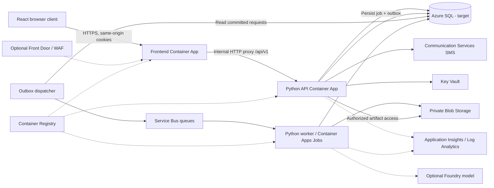
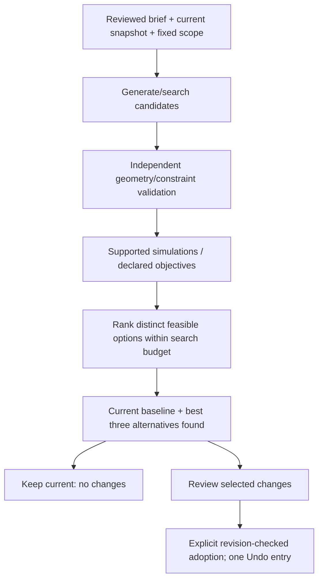

# HomePlanner architecture

**Status: incremental implementation, not a production deployment.**
Updated 8 October 2026. Azure is the selected provider for hosted services.
No Azure resources have been provisioned by this migration.

**Database decision, 8 October 2026:** Azure SQL Database's free General Purpose
serverless offer is selected for development/testing in South India, subject to
the offer being available in the subscription. Configure **Auto-pause the database
until next month**, not paid continuation. Current backend code still targets
PostgreSQL; Azure SQL driver, migrations, concurrency and auto-pause connection
handling are pending. This document records the target, not a completed migration.
See [billing conditions and networking costs](BILLING.md).

## 1. Goals and boundaries

HomePlanner is migrating from a local-first JavaScript planner with optional
Flask services to three layers:

| Layer | Responsibility |
|---|---|
| React / TypeScript frontend | Rendering, navigation, selection, transient interaction and uncommitted input drafts |
| Python backend and workers | Accepted project commands, geometry/rule validation, generation, simulations and exports |
| Azure SQL Database (selected target; backend migration pending) | Account ownership, durable projects/revisions, authentication and job records |

The locked navigation is **Site / Design / Analyze / Compare**. Manual editing
and AI assistance share Design. Exports live in their corresponding tabs.
Jobs is a small header panel for background operations.

**Current native Site stage:** Python now owns a separate versioned Site/Costs
document with account isolation, compare-and-swap commands and durable Undo/Redo.
React provides the plot form, offline coordinate-derived IANA zone and surroundings drawing/resizing,
including objects across roads. Costs and Utilization live under Analyze;
Design currently exposes only Layout. Retained Table III/IV/TDR scenarios,
opt-in legacy fee breakdowns and size/aspect/split comparisons are implemented,
but this document is not yet canonical room geometry. Current fee/legal
verification, native 2D/3D editing and room-based Environment engines remain
staged. See the
[completed scope and limits](docs/python-react-platform.md#native-site-migration-first-stage).

**Analysis does not generate alternatives.** Run study analyzes the existing
authored plan only. Explicit Design AI assistance or **Generate alternate optimal
plans** starts a search. The result selection contains the current/manual baseline
and three distinct evaluated feasible alternatives, when available. Applying
one is explicit and Undoable; the current plan is never silently replaced.

## 2. Azure resources needed

See [billing and free allowances](BILLING.md) for the minimal-development cost
model, introductory-offer limits and charges not covered by compute grants.

Quantities below are a starting inventory for **one environment**, not purchased
capacity or a validated sizing recommendation. Production and nonproduction need
separate data, identities and configuration.

### Core application and platform resources

| Resource | Starting inventory | Purpose / timing |
|---|---|---|
| Resource group | 1 per environment | Lifecycle and cost boundary; not an authorization boundary |
| Azure Container Apps environment | 1 | Shared hosting/network context for frontend, API and workers |
| Frontend Container App | 1 | Serve built React assets and reverse-proxy `/api/v1` to the internal API under the same HTTPS origin |
| API Container App | 1 | FastAPI HTTP service; scale independently of simulations |
| Azure Container Registry | 1, optionally shared | Store versioned frontend, API and engine images; access through managed identities |
| Azure SQL logical server + free-offer database | 1 logical server, 1 General Purpose serverless database | Selected dev/test target; current metadata backend still uses PostgreSQL. Free-limit pause makes all database-backed capabilities unavailable until renewal |
| Azure Communication Services resource + approved SMS sender | 1 resource; sender arrangement depends on eligibility | Mandatory phone OTP delivery; ACS is transport, not the OTP/session authority |
| Azure Key Vault | 1 | Authentication secret and credentials that cannot yet use identity-based access |
| Log Analytics workspace | 1 | Container/runtime diagnostics and controlled-retention operational logs |
| Application Insights resource | 1 | API/worker tracing, latency, failure and dependency telemetry |
| Managed identities and scoped role assignments | By runtime responsibility | Separate frontend/API/worker privileges; no keys in React or container images |
| Virtual network, required subnets, SQL private endpoint and private DNS | 1 VNet, 1 SQL private endpoint and DNS zone; layout determined during deployment design | Container Apps integration and private Azure SQL access; endpoint and DNS costs are outside the database free offer |

### Required for the complete simulation/design platform

| Resource | Starting inventory | Purpose / timing |
|---|---|---|
| Azure Service Bus namespace | 1 | Reliable dispatch separate from HTTP requests; not required to demo the current metadata-only slice |
| Service Bus queues and dead-letter handling | Initially analysis and optimization queues | Separate workloads, retries and admission limits; messages carry identifiers, not project documents |
| Container Apps worker / event-driven Jobs | At least 1 worker profile; split by engine as needed | Bounded simulation, optimization and export executions; no public worker ingress |
| Azure Storage account with private Blob containers | 1 | Input snapshots, engine artifacts, study outputs and generated reports |
| Private endpoints / DNS for selected data services | As required | Private Blob/Key Vault/Service Bus access; verify each service's SKU/networking support before selection |

Choose Service Bus SKU after deciding private-network requirements and throughput.
Do not assume a lower-cost tier supports every private connectivity feature.
Likewise, size Azure SQL, Container Apps workload profiles and registry/network
features from measured workloads rather than assigning unverified SKUs here.

### Conditional resources, not baseline requirements

| Resource | Add only when |
|---|---|
| Azure Front Door with WAF | Public production ingress needs edge abuse protection, global routing or CDN; recommended before broad public exposure, not required for a local demo |
| Microsoft Foundry model deployment / Azure OpenAI | An implemented, explicit language-model feature needs brief interpretation or proposal assistance; deterministic constraints do not require an LLM |
| Azure AI Search | Licensed reference/regulation retrieval is implemented and needs managed indexing |
| Azure Maps | A map/geocoding feature is deliberately implemented; maps do not prove plot boundaries |
| Azure Managed Redis | Measured cache/rate-limit pressure justifies it; current sessions/limits remain database-backed |
| Azure Batch or specialized Azure compute | Heavy CFD/HPC workload requirements exceed validated Container Apps capabilities |

AKS, Cosmos DB, API Management and SignalR are **not required by the current
design**. Do not add them simply to describe the system as scalable.

## 3. Target topology

All lines below describe the **target architecture**; most integrations are
pending. The API is the only project authorization/command entry point.

Frontend public ingress terminates HTTPS. The API has internal ingress and
receives the original browser Origin through the trusted proxy. Frontend and API
share one public origin; no wildcard CORS or cross-site authentication workaround.
If Front Door is added, prevent bypass of edge restrictions through the origin.
Only explicitly trusted proxy configuration may supply client-address headers.

The browser never connects to the database, Service Bus or the SMS SDK. Worker
access is identity-scoped. Artifact access is authorized through the API or
short-lived, least-privilege URLs after ownership checks; storage is not public.

## 4. Implemented versus planned

| Capability | Current implementation |
|---|---|
| Python HTTP API | `backend/api.py`, FastAPI `/api/v1` routes |
| Configuration guards | `backend/config.py`; production requires PostgreSQL and explicit HTTPS origins |
| SMS transport | `backend/sms.py`, ACS SDK with `DefaultAzureCredential`; live sends disabled by default; no handset-delivery verification yet |
| Phone authentication | Phone normalization, keyed OTP digests, expiry/attempt/replay protection, persistent rate limits and opaque sessions |
| Project persistence | Owner-scoped **metadata only**: create/list/read/rename, optimistic version checks and metadata revision history |
| Database migration | Alembic initial schema in `backend/migrations`; explicitly applied, not startup `create_all` |
| React HTTP frontend | `platform.html`, `src/platform`; phone/code forms and project management |
| Offline local development | `python -m backend.local`: dedicated durable SQLite, random persistent session secret, loopback-only simulated OTP inbox; forbidden in production |
| Analyze Python utilities | Solar uses real pvlib; Airflow density uses real PsychroLib through authenticated owner-scoped endpoints. Supplied-input utilities only, not geometry-dependent plan studies |
| Legacy runtime | `index.html` and `app.py` remain intact; existing projects are not uploaded |
| Geometry editing / canonical Python commands | Pending; existing JavaScript authority still owns legacy project geometry |
| Python simulation migration | Pending; existing optional Python modules are not integrated into the new authenticated worker pipeline |
| Jobs / Service Bus / Blob | Pending; current Jobs endpoint explicitly reports unavailable worker migration |
| Alternative-plan generation / ranking / adoption | Pending; controls disabled, no fabricated options |
| Cloud containers / networking / identity / telemetry | Target design only; no IaC or Azure deployment yet |

The user has deferred Azure resource creation in favor of local implementation.
Full Analyze engines retain the documented Python/headless toolchain: Radiance
for Light, the separate OpenFOAM Python case/runtime for detailed Airflow, and
the compatible EnergyPlus translation/runner for Thermal & energy. Their
canonical authored-geometry adapters and native runtime execution remain pending;
the solar/property utilities do not satisfy those full engine contracts.

The current database tables are `users`, `auth_limits`, `otp_challenges`,
`login_sessions`, `projects` and `project_revisions`.
`project_revisions.metadata_snapshot` contains project-name metadata, **not
canonical room geometry or full project history**.

## 5. Authentication and authorization

1. The user explicitly requests an SMS code with an international phone number.
2. Python validates/normalizes it, reserves database-backed send limits and stores
   a short-lived keyed digest, not the plain code.
3. ACS submits the message using the backend identity and registered sender.
   Provider rejection invalidates the challenge; submission acceptance is not
   proof of handset delivery.
4. Successful one-time verification resolves a stable user ID and issues an
   opaque HttpOnly session cookie. Phone is the sign-in identifier; user ID owns
   project records.
5. Every project, job and artifact route checks account ownership. Missing or
   foreign projects return not-found without disclosing another account's data.

Production cookies are Secure, host-only and SameSite Strict. Mutations require
JSON, an allowed Origin and a session-bound CSRF token. Raw phones, OTPs, session
tokens and credentials must not appear in logs, telemetry or model prompts.
Infrastructure identities do not replace end-user project authorization.

Existing row-level checks require PostgreSQL replica-concurrency verification.
Ingress-level bot protection, account recovery, phone-change/recycling policy,
secret rotation, retention cleanup and distributed abuse tests remain production
gates, not completed features.

## 6. Project integrity and migration

The intended authoritative Python project service will accept validated commands,
not renderer object mutations. React may preview a gesture and keep drafts, but
only an accepted backend transaction advances authored state.

- Preserve existing project/floor/entity IDs, inactive floors, unknown fields,
  nullable physical inputs and unresolved references.
- Import legacy projects only through explicit staged validation and acceptance.
  Signing in must never upload or reset browser projects.
- Distinguish plot, buildable plate, building, clear room footprints and usable
  regions. Lift/stair reservations retain full wall-inclusive geometry.
- A completed edit or accepted compound proposal produces one history entry.
  Navigation, selection, previews and analysis do not mutate geometry.
- Persistence version, geometry revision and analysis identity are separate.
  Existing `inputFingerprint` is canonical JSON text, not a replacement SHA hash.
  Carry it opaquely across the migration; artifact checksums have another purpose.
- Conflict responses retain drafts. Invalid commands preserve the exact original
  state rather than regenerating an approximation.

This migration must not introduce a second competing geometry store in React
while the incumbent project remains JavaScript-owned. Python schema/command
parity and old/new round-trip evidence are prerequisites to replacing authority.

## 7. Background job flow

The target flow is durable, idempotent and explicitly initiated:

1. User clicks Run study or the separate generation action.
2. API verifies ownership, prerequisites, allowed edit scope, per-user limits and
   engine availability. Capture a detached input snapshot and method/version.
3. In one PostgreSQL transaction, persist the job and outbox event. A dispatcher
   publishes committed work to Service Bus; retries use stable identifiers.
4. Worker claims work with a lease, loads the snapshot and runs a bounded engine.
   Queue redelivery is expected; duplicate execution must not duplicate adoption
   or publish multiple authoritative outcomes.
5. Store artifacts privately in Blob Storage and persist status/result metadata
   in PostgreSQL before completing the message. Failed jobs retain explicit
   diagnostics; poison messages go to dead-letter handling.
6. Jobs panel queries authenticated job state. Cancellation is cooperative,
   including terminating owned solver subprocesses and rejecting late publication.
7. Before showing a result as current or adopting a candidate, compare actual
   input identity and job generation against the current project. Preserve stale
   results as labeled historical evidence, not active results.

Container Apps event-driven Jobs fit finite engine runs. A queue-driven worker
Container App fits a continuously consuming worker. Select based on engine
startup cost, duration and lease behavior; neither guarantees exactly-once
business processing. Persist heartbeat/lease information and recover abandoned
runs without silently treating them as complete.

Do not run heavy simulations inside an API request, store authoritative jobs only
in process memory, or use container-local files as durable project storage.

## 8. Alternative-plan optimization

Both Design AI assistance and Analyze's explicit generation action use a shared
pipeline:

Pinned geometry is a hard constraint. Candidates cannot silently move protected
rooms, remove required rooms, change opening operation or alter untouched floors.
Evaluate comparable boundary conditions, methods, units and numerical settings,
recomputing geometry-dependent quantities per candidate.

Rank only supported, completed, numerically acceptable evidence. Current light
metrics are geometric access, not lux or annual adequacy; reduced-model airflow
is not validated CFD or proof of fresh-air effectiveness. Missing physical
inputs remain unknown. A search returns best options found within its budget,
not a certified global optimum or a legally approved/engineered design.

If fewer than three distinct feasible alternatives exist, explain unavailable
slots. An empty baseline is labeled not yet designed, not a completed fourth
plan. Human selection, not the ranking engine, controls adoption.

## 9. Scalability, extensibility and operations

Keep HTTP handlers stateless apart from shared durable storage. Independently
scale API and worker pools; cap database connections across replicas and measure
pool pressure before increasing replicas. Bound queue depth, CPU/memory, solver
duration, retry counts, candidate counts and per-user concurrency/cost.

New simulation methods use versioned Python engine adapters with explicit input,
output, units, prerequisite and provenance contracts. Declare unsupported
capabilities rather than silently falling back to weaker calculations. An engine
container does not establish physical or numerical validation.

Use versioned image releases and a one-shot, controlled migration step rather
than letting every API replica migrate the database. Prefer additive schema
changes and maintain compatibility across rolling releases. Define database
backup/PITR, Blob retention, restore drills, HA and RPO/RTO before production.
No recovery or availability targets have been measured or agreed yet.

Azure-hosted diagnostics should correlate request/job IDs without recording
project geometry or authentication secrets. Add budget alerts, SMS-spend
controls, queue age/dead-letter alarms, database pressure and worker-failure
alerts. No operational dashboard or alert rules exist yet.

## 10. Deployment decisions still needed

The selected dev/test offer is MSDN and the estimate region is South India.
Azure SQL free-offer application and regional availability still need confirmation.
Expected traffic/concurrent engine runs, budget, domain,
SMS sender/recipient-country eligibility, data residency, private-network choices
and production recovery targets must be confirmed before sizing/provisioning.
Use AZD/Bicep as the planned infrastructure approach, with deployment validation
and separate provisioning approval. Resource selection here is not consent to
create paid services.

Especially verify ACS availability, sender registration and current service
changes for the countries served; selecting Azure does not guarantee that every
phone can receive OTPs.

## 11. References and related repository documents

- [Platform setup and current implementation boundaries](docs/python-react-platform.md)
- [Deployment preparation record](.azure/deployment-plan.md)
- [Canonical incumbent project contracts](docs/project-model.md)
- [Constraint-first AI floor-plan roadmap](docs/plan/ai-floor-plan-generator.md)
- [Azure Container Apps Jobs](https://learn.microsoft.com/en-us/azure/container-apps/jobs)
- [Azure SQL Database free offer](https://learn.microsoft.com/en-us/azure/azure-sql/database/free-offer)
- [Azure SQL private endpoints](https://learn.microsoft.com/en-us/azure/azure-sql/database/private-endpoint-overview)
- [Service Bus queues/topics](https://learn.microsoft.com/en-us/azure/service-bus-messaging/service-bus-queues-topics-subscriptions)
- [ACS SMS prerequisites and Python SDK](https://learn.microsoft.com/en-us/azure/communication-services/quickstarts/sms/send?pivots=programming-language-python)
