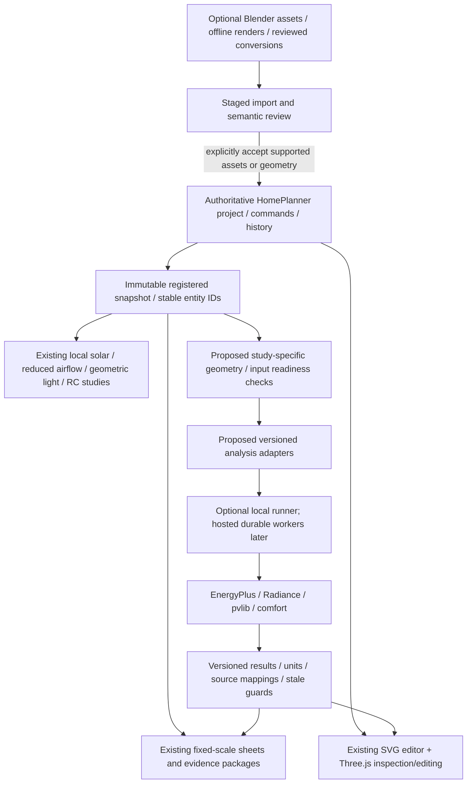

# Implementation review and next-delivery plan

**Review date:** 17 September 2026.  
**Scope:** the reviewed checkout, the [existing roadmap](building-performance-roadmap.md),
the [persisted research](research/building-performance.md) and the supplied
Three.js / Blender / Python-engine proposals. The user subsequently approved
the R0 fixes and a second review with working local Python utilities, implemented
below. Whole-building engine/interop capabilities remain planned. Original source-line references describe the
pre-fix review snapshot; current API contracts are in the linked feature docs.

## R0 remediation completed

The following fixes are in the working tree. Three.js, the shared project,
local-first storage and the existing native study meanings are retained.
The initial R0 work installed no external engines or optional Python libraries.
The subsequently approved PsychroLib/pvlib utilities are recorded separately below.

| Original issue | Implemented correction |
| --- | --- |
| Missing draft dependency / partial startup | Drafts loads before every consumer, including Electrical. Missing prerequisites fail before subscriptions; partial persistence initialization cleans up. |
| Observer failures after commit | Each observer is isolated; failures are reported through bridge/persistence diagnostics without throwing a committed edit back as failure or starving other views. Authored no-ops preserve history and snapshot identity. |
| Lost provenance / double history | Site/building input and provenance are atomic. Solar, wind, assembly, pressure and thermal evaluation calculate before storing their inputs/results together in one command; failed evaluation preserves the pending draft. |
| Lost inspector drafts | Numeric and staged opening/partition drafts are owner-qualified, parked across selection/floor/project changes, conflict-checked and discarded only explicitly or after successful application. Persistence sees current and parked drafts. |
| Replacement / New Project | Imported/replaced snapshots undergo exact preservation checks and rollback, including metadata/nulls/inactive floors. New Project has a private initialize-then-verify path for starter defaults; it does not weaken public import guards. |
| Missing direct actions | Production hosted-opening hooks and shared 2D/3D inspector requests are wired. Both toolbars provide supported selection actions and shared history; no private renderer mutation/history path was added. |
| Generated/custom opening parity | Both retain source records and prior edits while suppressing effective apertures. Merged raw source aliases are floor-namespaced correctly. Existing full-wall apertures remain editable/deletable when only their masonry is absent. Canonical hosted windows retain internal/exterior support; the older room-edge palette stays exterior-only. |
| Balcony IDs / frame / 3D | Generation uses stable identities; middle deletion preserves siblings. Balcony rectangles translate into the site frame exactly once and render/pick in 3D with the original model IDs. |
| Layout JSON actions | Room Planner Import/Export JSON buttons reuse the complete-project persistence picker, confirmation and download flow, including inactive floors and dimensions. |
| Missing calculation references | All 12 skills now include equations, worked calculations, Python-tool guidance and deterministic standard-library examples with labelled SVG output. |

**Verification:** the integrated Node selectors finished with 1,427 passes,
zero failures and one existing optional supplied-artifact skip
(`HOMEPLANNER_PHASE10_FIXTURE` was not provided). The reference validator
completed all 12 packages, 390 checks and 12 labelled SVG renders. Optional
library snippets are syntax-checked guidance, not executed engine evidence.

Production browser cases passed against unchanged application bytes on
disposable local origins: startup/New Project, cross-page drafts and source
navigation, one-step input/result Undo, actual Room Planner JSON buttons,
generated-opening suppression and JSON restoration, exact wall-end controls,
real 3D ray picking/actions/history, middle-balcony deletion, all four starter
frontages, layout/furniture preservation, mouse/touch cancellation and
desktop/mobile staircase-passage protection. No test-only page hooks or
2D-history fallback were used by the direct-action test.

See [editor contracts](editor-workspace.md),
[persistence/replacement behavior](local-persistence.md),
[3D actions](three-dimensional.md) and
[environment history](environment-analysis.md) for the implemented behavior.
The original findings below remain an audit trail, not a list of still-open
R0 defects. This completion is not an external-engine, engineering, regulatory
or scientific-validation claim.

## Second review and working-tool follow-up completed

The follow-up found and corrected additional paths which the first review did
not cover:

| Reproduced issue / approved addition | Delivered behavior |
| --- | --- |
| Clearing a quantity erased rooms and IDs while typing | Numeric room settings are owned drafts. Apply/Enter validates the whole pending batch and makes one edit; blur does not commit. Save/JSON use committed values, and conflicting saved inputs require explicit review. |
| New defaults silently pinned retained furniture or promoted unknown direction | Restoration preserves pin/head metadata and explicit absence. Relocation warnings do not change pinning. New furniture can round-trip through grouped Apply, Undo and Redo without weakening exact snapshot guards. |
| Solar/wind displays survived Undo or changed weather | Saved displays match their actual inputs and weather content, including same-ID changes, Clear/Undo, discarded drafts and monthly publication. Restoration does not rerun calculations. |
| Touch compatibility events committed a draft before Cancel | Navigation parking now spans touch-generated mouse/focus events; Cancel retains the original geometry and pending value. |
| Surviving full-wall apertures lost annotation/dimension anchors | Opening-entity anchors no longer require masonry when their canonical aperture survives. Actual removed-wall anchors and missing openings remain unresolved. |
| Deleting an object lost keyboard focus | Successful confirmed deletion restores the persistent inspector heading; failure and Cancel retain their correct focus targets. |
| Staircases looked like rooms with automatic doors and oversized passage locks | New stairs use an open profile and a schematic flight/landing/UP symbol. Entry clearance is bounded; the side guide is advisory, unfilled and selected-only. Existing enclosed stairs can explicitly switch through their properties with Undo and unchanged footprints. Authored opening sources remain recoverable. |
| “Intent” switches mostly produced warnings | 3D now has clear Show-layer labels, actual record counts, disabled empty layers and working setup links. Short status stays above the drawing; qualifications and exact metadata are collapsed. Clearing light results removes stale meshes while retaining visibility preference. |
| Python libraries were only referenced | Real local PsychroLib air-density and pvlib solar-position/day-path endpoints and routed UI cards are installed and working. The existing browser/Three.js tools remain. |
| Density required manual physics inputs despite location/weather | The density card uses imported weather, familiar manual inputs, or an explicitly disclosed Open-Meteo location-weather action. Fetched samples remain session-only and do not replace imported data; late responses cannot overwrite later edits. |

The running service is the existing Flask application with
`requirements-analysis.txt`, not a new cloud/API/database stack. See
[working Python calculations](python-analysis.md). This utility slice does
not implement EnergyPlus, Radiance, PV yield, a coupled thermal/CFD solver or
mold growth. The supplied simulator link remains an interaction reference,
not copied or validated solver code.

**Follow-up evidence:** 1,530 Node tests passed with no failures and the same
one optional original-fixture skip; 21 Python analysis tests and 77 existing
property-service tests passed. Production browser cases exercised programme
drafts/Apply/Undo/JSON, real Python results, layer links, stair switching and
symbols, solar/wind restoration, existing cross-page flows and desktop/mobile
movement. Eight native mouse/touch interaction cases and the unstaged direct
2D/3D action suite passed. A live location-weather request at the public
synthetic point 0°,0° returned model weather and real PsychroLib density;
no user site or private project was used for that check.

For an older saved staircase, select it and choose **Open staircase** in its
Enclosure properties to remove the generated enclosure/door reversibly.
Old enclosure intent is not silently overwritten on loading a backup.

## Architecture recommendation

**Keep Three.js and the current SVG editor. Keep Blender optional.**
The authoritative object is the existing structured HomePlanner project, not
a Three.js scene, Blender mesh, rendered image or external engine input.

The next missing work is not another renderer: it is translating reviewed
physical semantics into reproducible analysis inputs after the R0 integration
fixes, with the explicit capability gates below.

React, FastAPI, PostgreSQL, Redis/RabbitMQ and containers are deployment or
implementation choices, not requirements for using Three.js or finishing the
current editor. Keep the existing local-first entry point working without them.
Heavy external engines need managed execution, but a multi-user cloud platform
is not a prerequisite for a bounded local reference run.

The earlier **brief-to-constrained-editable-house** product goal remains intact.
Neither an arbitrary Blender importer nor an EnergyPlus demonstration box
replaces that goal. Synthetic boxes are validation fixtures, not substitute
geometry for a user's active house.

## 1. Current implementation versus proposed capability

| Capability | Current evidence | Classification / missing boundary |
| --- | --- | --- |
| Structured project and identity | `planner-model.js:209-247,702-759,1229-1264` validates schema 1, floor/source IDs, effective walls/openings and reserved usable regions | **Existing foundation.** Not a complete general-purpose BIM or thermal-zone schema. Preserve it rather than introduce a second editable store. |
| Registered snapshots | `planner-projection.js:19-32,78-98,209-222` supplies site transforms, `DrawingScene` and purpose/engine/input provenance | **Existing foundation.** Reuse this capture boundary; add study-specific validation and immutable engine bundles. Do not rebuild coordinate handling in every adapter. |
| Browser 3D | `planner-3d.js` uses local Three.js, effective geometry, usable floor fragments, balcony picking and shared inspector requests | **Supported actions integrated.** Shared edit/add-opening/delete/wall-end/history controls are present; arbitrary wall topology or freeform 3D authoring is not added. |
| Room layout/editing | Rectangular generator, preserved manual snapshots, stable identities and shared commands | **Existing supported editing stabilized.** Required-room/area guarantees, diverse AI candidates and arbitrary polygons are not implied by a successful packing attempt. |
| Drafts, history and local JSON | `planner-drafts.js`, `planner-bridge.js`, `planner-storage.js`, `planner-persistence.js` and production loader | **R0 corrections integrated.** Owner-qualified drafts, atomic provenance/history, exact replacements, private New initialization and reusable complete-project JSON actions are present. |
| Sun and shading | `sun-model.js`, `sun-exposure.js` and `building-physics.js` provide civil-time/solar geometry, pole shadows and current-house surface exposure | **Native supported methods.** Not a PV system, annual energy model or complete surveyed context. Existing whole-house shading must not be listed as wholly absent. |
| Room airflow | `planner-airflow.js` invokes `engine.run(result,draft.planField)` only when enabled; the airflow worker imports the field engine, and runner/display/UI modules handle `result.planField` | **Implemented kernel and module wiring.** Pressure-network flow and optional depth-averaged potential-flow velocity are distinct outputs. Neither is validated three-dimensional CFD or occupant-height airspeed. Explicit physical/scenario inputs remain required. |
| Room light | `planner-light.js` and local runner/display modules | **Geometric access study.** Dimensionless sky/path access and sun-duration quantities are not lux, daylight factor, sDA/ASE or glare. Radiance is a new adapter. |
| Materials and thermal scenarios | `building-physics.js`, `environment-ui.js` | **Assembly descriptors and sensible RC scenarios.** No automatic whole-building weather/HVAC/moisture coupling, annual equipment consumption or equipment recommendation. |
| Weather | `environment-data.js` parses EPW/JSON/provider data with units, interval and missing-value metadata | **Existing normalized inputs.** Engine runs additionally need original weather bytes, complete release-specific weather QA and explicit calendar/site policy. |
| Drawings/reports | `planner-drawing-export.js:228`; `planner-package.js:50-81,439` | **Existing SVG/PDF/PNG and coordinated evidence packages.** Reuse fixed paper scale, continuation pages and manifests. These are not GLB, IFC or engine exports. |
| Python runtime | `app.py`, `python_analysis.py`, `requirements-analysis.txt`, `planner-python-analysis.js` | **Working optional local utilities.** PsychroLib density, explicit location-weather retrieval and pvlib solar position/path accompany the property-report service. Whole-building energy, Radiance, comfort, Blender and generic engine jobs are not added. |
| Blender / GLB / IFC | No such application adapters or `performance` implementation directory were found | **Proposed.** Start with optional visual assets/export; semantic IFC conversion and arbitrary mesh recovery are separate, later capabilities. |
| Mold and moisture | Current sensible-only thermal scope and the [persisted humidity review](research/building-humidity-mold-risk.md) | **Not implemented.** Psychrometric properties, surface condensation and dynamic mold-index prediction require separate input/model gates. |
| Specialist calculation references | All 12 packages contain `calculations.md`, `python-tools.md` and executable reference scripts | **Completed reference enrichment.** Equations/examples and local checks do not install or validate the documented optional engine stack. |

Existence of a module or test does not establish successful browser integration,
empirical accuracy or a completed external-engine workflow. Native kernel
capabilities must retain their current names, units and qualifications.

The airflow follow-up specifically confirmed a bounded **2D finite-volume
potential-flow field**, not merely decorative arrows: cells contain
`velocityMps`, `speedMps` and conservation residuals; model depth is declared
zone volume divided by usable area; solved aperture fluxes are mapped to the
mesh, with wall/reservation exclusion and explicit disconnected-flow failures.
This belongs to `planner-airflow-field.js`, not `planner-light.js`. Preserve
and qualify this existing implementation rather than planning a room field
as though none exists. Its source wiring is not empirical CFD validation.

## 2. Original integration findings and separate engine-readiness gap

The P0/P1 findings in this section were repaired under R0, as recorded above.
Their old file/line references and reproduction details are retained for the
audit trail. The final R1 engine-geometry subsection remains future work.

### Startup dependency and notification failure (P0)

`index.html:6335-6374` does not load `planner-drafts.js`. The browser branch
of persistence captures that missing dependency at `planner-persistence.js:5`
and reaches an undefined `subscribe` at line 215. A later real bridge command
then reaches undefined `pending` at line 76 because the failed initialization
already attached its project listener at line 205.

The review reproduced these failures by executing the browser module branch
in memory. A rename committed revision 0 to 1 and created Undo, but the
observer exception was thrown to its caller and prevented a later observer
from receiving the change. `planner-bridge.js:129-131,161` emits after commit
without isolating observer failures. This is more serious than a missing
status label: the caller can see failure for a committed edit while other views
remain stale.

**First R0 work:** establish dependency-ordered startup; report a missing
dependency explicitly; clean up partial mounts; make subscriber failures
visible without misreporting a committed transaction or starving later
subscribers. Verify the production page without test-only injected scripts.
Do not merely add an optional-chain/default that hides unavailable draft
protection.

### Compound provenance and history (P1)

Site/building handlers submit `environmentPatch`
(`environment-ui.js:907,922,936`), but the corresponding bridge branch does not
apply it (`planner-bridge.js:245-253`). Real-controller probes changed the
coordinates/dimensions without retaining `siteProvenance` or
`buildingAssumptions`. The narrow UI tests inspect the emitted command rather
than its result in the real project (`tests/environment-ui-state.test.cjs:100-128`).

Material Evaluate still submits input and result as separate commands
(`environment-ui.js:1131-1132,542-546`); a handler probe, with only numerical
calculation stubbed, created two revisions. One Undo removed the result but
left the new input. Pressure/thermal evaluation follows the same pattern at
lines 1210-1212 and 1223-1225.

**Plan:** validate/apply input plus source metadata as one authored transaction.
Decide explicitly whether computation results belong in that compound action
or a separate non-history derived cache. Preserve the original calculation
provenance in either case. Test UI handler -> real bridge -> saved document ->
Undo/Redo, not just the command object.

### Direct actions and JSON entry points (P1)

The existing command implementations do not establish production UI parity:

- Balcony generation still assigns `balcony-${i+1}` (`index.html:2208`) while
  deletion expects stable identities (`planner-bridge.js:632-651`). Middle-item
  deletion can trigger the deliberate rollback check at lines 389-395.
- `prepareHostedOpenings` exists (`planner-bridge.js:724`) but the production
  index opening pipeline does not call it (`index.html:3578-3579`).
- `tests/planner-direct-actions-browser.cjs:13-48` can stage missing hooks and
  the draft dependency. A staged test pass is not evidence that the real
  script loader includes them.
- Opening deletion remains custom-only (`planner-bridge.js:620-626`); the
  shared opening inspector lacks the selected-opening delete action
  (`planner-editor.js:684-822`). Complete generated/custom edit/delete and
  suppression/restore behavior through the same command contract.
- Persistence already exposes reusable JSON request methods
  (`planner-persistence.js:747-775`), but the model toolbar has no callers
  (`index.html:1072-1087`). Wire the existing import/export flow, not a
  lossy layout-only codec.

There are no canonical `add-room`, `add-furniture` or `update-balcony`
commands in the reviewed bridge, and the editor instance only exposes
`render`/`destroy` (`planner-editor.js:1356-1363`). Retain the existing validated
legacy actions while defining only the shared requests needed for cross-view
parity; do not assume an API exists or introduce a second mutation path.
Arbitrary wall creation/movement remains a later authoring capability, distinct
from the scoped retained-wall-span controls.

**Plan:** test unmodified production startup, then action -> shared model ->
both views -> one Undo/Redo -> JSON restore, including middle-balcony deletion,
generated openings, exact wall-end operations, invalid inputs and cancellation.

### Unregistered inspector drafts and replacement integrity (P1)

The draft registry correctly scopes entries by project/floor/collection/entity,
but inspector drafts remain local variables/DOM values
(`planner-editor.js:492-570,840-895`). Rebuilding selection/floor sections can
lose rejected numeric or staged opening/trim drafts
(`planner-editor.js:587-590,1085-1087`), and persistence replacement/unload
guards cannot see them (`planner-persistence.js:623-625,807-809`).

Undo compares restored geometry (`planner-bridge.js:431-447`).
Import/replacement restores and recaptures without comparing the accepted
candidate (`planner-bridge.js:449-460`); browser capture uses a fixed legacy
field set at lines 539-549. A **synthetic adapter** probe accepted a valid
revision-9 import while dropping a valid extension field at the recapture
boundary. This demonstrates a coordinator contract gap, not a claimed
full-browser import-loss reproduction.

Persistence Open detects changed reconstruction only after replacement
(`planner-persistence.js:430-439`); `importPrepared` has no equivalent comparison
at lines 464-477. The raw bridge import and the persistence importer which
allocates a new ID must retain their distinct intended behaviors.

**Plan:** register every editable draft with its owner, preserve unrelated
drafts, prompt for explicit discard where required and stage/compare accepted
replacements before adoption. Rejection must preserve current work. Exercise
nullable values, same-schema extensions, inactive floors, same-ID Undo/
replacement and no-op commands; an identical rename must not create another
content revision merely as a side effect.

### Balcony frames and 3D parity (P1)

`planner-model.js:734-750` emits balcony records, but
`planner-projection.js:34-74` shifts room/wall/opening/furniture geometry and
does not shift `balcony.rect`. A detached probe with plot origin (-2,-3) and
balcony position (1,2) produced a `site-local` balcony still at (1,2); the
correct translated position is (3,5). The source was unchanged.

The Three.js renderer has no corresponding balcony render/picking path.
It still describes itself as inspection with editing in 2D
(`planner-3d.js:712-717`). Adding a scene collection alone does not finish
2D/3D delete, wall/opening actions or undo/history parity.

**Plan:** translate every supported geometry collection exactly once; add
balcony meshes with original model IDs; complete shared-command action wiring
and explicit unsupported actions. Verify nonzero plot origins, all cardinal
frontages, active/inactive floors, restore and one-step Undo. Do not make
Blender the workaround for incomplete current-model propagation.

### Numerical-reference coverage (P1)

`node --test tests\skills.test.cjs` currently reports 5 passing and 11 failing
checks: ten packages lack the required enrichment links, and the site Python
guide links to a drawing calculation reference which does not yet exist.
The two existing scripts pass 65 checks through the shared Python validator.

**Plan:** complete all ten remaining reference packages, including exact units,
assumptions, source-backed formulas, valid/invalid cases and actual computed
renders. Do not weaken the validator to disguise unfinished packages. Optional
library snippets need API/engine/version qualifications; passing the standalone
script is not evidence that optional packages were installed or executed.

### Engine-ready geometry is a separate acceptance gate (R1)

The shared model correctly distinguishes carpet, wall-centreline modules and
full lift/stair reservations. It is still derived from rectangular rooms and
cardinal frontage (`planner-model.js:629-649,702-727`). The optional authored
records are dimensions, fixtures, stair/structural intent and service routes,
not a complete thermal surface/material/HVAC model
(`planner-features.js:51-59`).

**Plan:** build a read-only analysis projection with explicit room-to-zone
mapping, closed surfaces, reference planes, reciprocal adjacency, floor/roof
contacts, hosted apertures and unresolved-state reporting. Validate volume and
area independently. Missing ceilings, stair voids, slab contacts or construction
properties cannot be borrowed from Three.js presentation constants.

An export or study must preserve host net regions and full service reservations,
not create overlapping volumes by extruding every room bounding rectangle.

## 3. Dependency-ordered delivery plan

These are gates, not a calendar estimate. Existing G0/GA/G1-G5 labels in the
larger roadmap remain useful; the stages below identify the next concrete work.

| Stage | Deliverable | Acceptance / dependency |
| --- | --- | --- |
| **R0 - completed scoped fixes** | Dependency/observer handling, atomic provenance/history, draft/import preservation, supported direct actions, balcony frames/3D and calculation references | Verified with real-bridge and unstaged production browser cases, desktop/touch layouts and the complete reference catalogue. This does not add the R1-R7 capabilities. |
| **R1 - structured readiness contract** | Reuse `DrawingScene`/snapshot APIs; define study capability profiles, source-ID maps, explicit physical assignments and validation diagnostics | One-zone and adjacent-zone fixtures close and preserve volume/area/adjacency; holes and reservations are exact; unknown boundary/material/operation blocks the affected study; no live-project mutation. |
| **R2 - local auditable engine slice** | Compare direct epJSON against Honeybee/OpenStudio on the same fixtures; select one production compiler; add a bounded local runner and artifact manifest | Pin compatible Python/engine/library versions; original EPW bytes and declared calendar; explicit Run/cancel; owned process stops; errors/logs preserved; outputs mapped to the captured inputs and entities; ideal loads labelled demand, not electricity. Depends on R1. |
| **R3 - usable multi-room energy** | Reviewed zone/construction/schedule assignments, partial/shared/inter-storey contacts, gains and a limited HVAC profile | Independent reference comparison, warmup/sizing/output coverage review, no double-counted partitions/ventilation/solar gains, baseline comparison preserves assumptions. Real equipment consumption requires its own profile. Depends on R2. |
| **R4 - discipline-specific evidence** | Radiance point-in-time illuminance first, then annual daylight/glare; pvlib unshaded PV first, then explicit shading/loss models; applicable comfort models | Each workflow has its own sources, inputs, metrics, unknown states, fixtures and resource limits. May reuse R1/R2 infrastructure without waiting for every HVAC feature in R3. Never relabel native reduced-model results. |
| **R5 - moisture and dynamic mold** | Psychrometric states, reviewed surface-temperature/RH time series, condensation indicators; only then evaluate a specific Finnish/VTT model implementation | Hourly surface evidence and material sensitivity/decline provenance; model/implementation license review; reference trajectories and wet/dry history cases; no prediction from room RH or U-value alone. Depends on the requisite measured or validated surface histories, not merely R2 completion. |
| **R6 - optional Blender and exchange** | Explicit browser visual export/assets; Blender offline authoring/rendering; later staged GLB/OBJ and a declared IFC subset | No Blender install for ordinary users; bounded files/textures, explicit units/origin, assets not thermal zones, deterministic source mappings, preview/review before adoption. IFC needs a dedicated semantic path. Independent of most physics once R0/R1 contracts hold. |
| **R7 - hosted execution when required** | API/auth, durable jobs/attempts, artifact storage, quotas, cancellation/restart recovery and tenancy | Select PostgreSQL/broker/container deployment from measured concurrency/privacy needs; duplicate jobs cannot publish twice; no automatic uploads. Local editing/export stays available. |
| **GA - retain the design product track** | Brief clarification, required-room/area constraints, bounded candidate generation/ranking and reversible adoption | Preserve the earlier confirmed house brief and area basis; no missing rooms hidden by ranking; manual edits survive acceptance. GA need not wait for EnergyPlus, Blender, React or hosted infrastructure. R0 is its immediate prerequisite. |

**Next planned batch is R1 plus the existing generation/adoption track** now
that the scoped R0 fixes are complete. Use a small R2 compatibility experiment
to establish actual engine cost and supported scope before committing to a
larger stack. These later batches still require implementation; this fix did
not start a renderer/frontend rewrite or install the packages from the chat.

## 4. Decisions to make explicit

- **One project authority.** Extend versioned authored study assignments where
  compatible. Generate immutable analysis snapshots and engine inputs; do not
  introduce a second writable performance project solely to run a rectangle.
  The older schema-2 migration proposal remains a later option for genuinely
  unsupported authoring, with an explicit authority handover and original backup.
- **One energy compiler.** The earlier roadmap provisionally selects direct
  epJSON. The supplied Honeybee recommendation reopens a compatibility decision,
  not permission to maintain two production exporters indefinitely. Compare
  geometry, ID mapping, required inputs, diagnostics and reference outputs first.
- **Local before hosted unless the use case requires otherwise.** A managed
  engine process and local artifact store can prove the interface. FastAPI,
  Celery/RQ, Redis/RabbitMQ and PostgreSQL should follow a selected deployment
  profile rather than become prerequisites for every user.
- **No mandatory React or Blender.** React islands may help new complex forms
  if justified; they are not a simulation requirement. Blender Geometry Nodes
  and Cycles help authoring/presentation, not browser editing, EnergyPlus
  semantics, certified lux or measured performance.
- **Metric-level acceptance, no feature-parity percentages.** The supplied
  70-90% / 100% claims have no defined comparison scope. Use named workflows,
  reproducible fixtures and explicit exclusions instead.
- **No arbitrary input scripts.** Engine/conversion commands are fixed reviewed
  adapters. Imported files, AI prompts and project metadata are data, not code.
  This is a design requirement, not a completed security assessment.

## 5. Mold-specific model choice

[PsychroLib](https://psychrometrics.github.io/psychrolib/api_docs.html) supplies
psychrometric properties. Surface condensation additionally needs an assessed
surface temperature. Dynamic growth assessment additionally needs exposure
history and material response.

The [Finnish mould growth model](https://research.tuni.fi/buildingphysics/finnish-mould-growth-model/),
developed by VTT and Tampere, is a candidate for R5: it uses hourly temperature
and RH at the assessed surface, material sensitivity/decline classes and a
history-dependent index M from 0 to 6. The university warns that the index does
not identify mold types or their hazard. Evaluate a precisely versioned
implementation against the developer's reference, including unfavorable periods
and material changes. Do not invent or transplant a universal pass threshold.

[WUFI Bio](https://wufi.de/en/wufi-bio/) is a different biohygrothermal
germination/growth-risk approach. Fraunhofer explicitly describes conservative
over-prediction and an interior-surface scope. Treat it as a separate expert
workflow, not an interchangeable Python function or a claim that WUFI is an
open-source dependency.

The [existing Simulations4All humidity review](research/building-humidity-mold-risk.md)
already warns that its compact growth expression is not proof of exact VTT or
ASHRAE implementation. Preserve that finding. Room-air RH, a condensation flag
or a predicted index cannot diagnose an infestation or health hazard.

## 6. Evidence and scope of verification

The original review inspected implementation and contract/test sources, ran the skill
reference checks and a detached balcony projection probe, and used separate
read-only numerical and workflow reviews. The workflow review ran its focused
direct-action/draft/storage/environment-state selectors and in-memory
browser-branch/controller/handler probes; the numerical review inspected
source/test contracts but did not execute its numerical tests.

The existing local server refused connections during that original review.
For the subsequent approved fixes, disposable ephemeral servers served the
unmodified production files, and isolated browser acceptance passed as listed
in the remediation section. No live browser project was used as a fixture.
This is not a full application,
security, visual-accessibility or scientific-validation certification.

For implementation, add the smallest relevant regressions and then exercise
the actual browser surfaces in disposable contexts. In particular:

- Room addition/move/resize/rotation/deletion, passage keep-clear, generated and
  custom openings, Undo/Redo, fresh startup, floor switches and JSON restoration.
- Current/edited/multi-floor study inputs, exact reservation masking,
  unknown/zero/failure states, canceled/stale completions and published artifacts.
- Analytic geometry cases plus an independent engine reference for every new
  compiler profile; measured calibration is a separate claim.
- GLB appearance round trips separately from structured project round trips;
  preserve unsupported IFC records and original inputs for review.
- All twelve offline skill scripts and links; syntax checking an optional
  library snippet does not validate its execution or a complete engine bundle.

New external references checked on 17 September 2026:
[Three.js GLTFLoader](https://threejs.org/docs/pages/GLTFLoader.html),
[Blender glTF export](https://docs.blender.org/manual/en/4.5/addons/import_export/scene_gltf2.html),
[Cycles](https://docs.blender.org/manual/en/4.5/render/cycles/introduction.html),
the Finnish model and WUFI Bio links above. The larger roadmap retains its
earlier dated source register; its engine interoperability is still a delivery
gate, not something this review claims to have tested.
