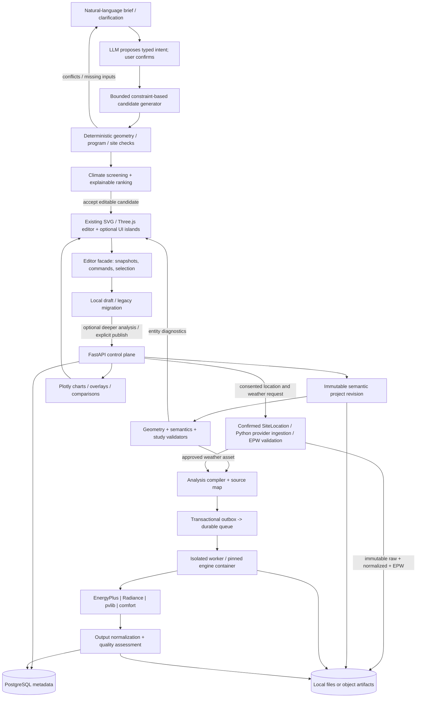
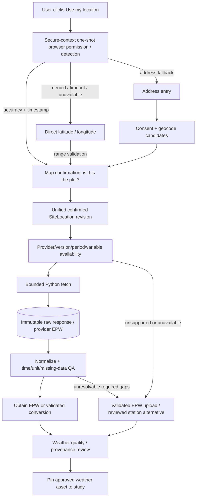
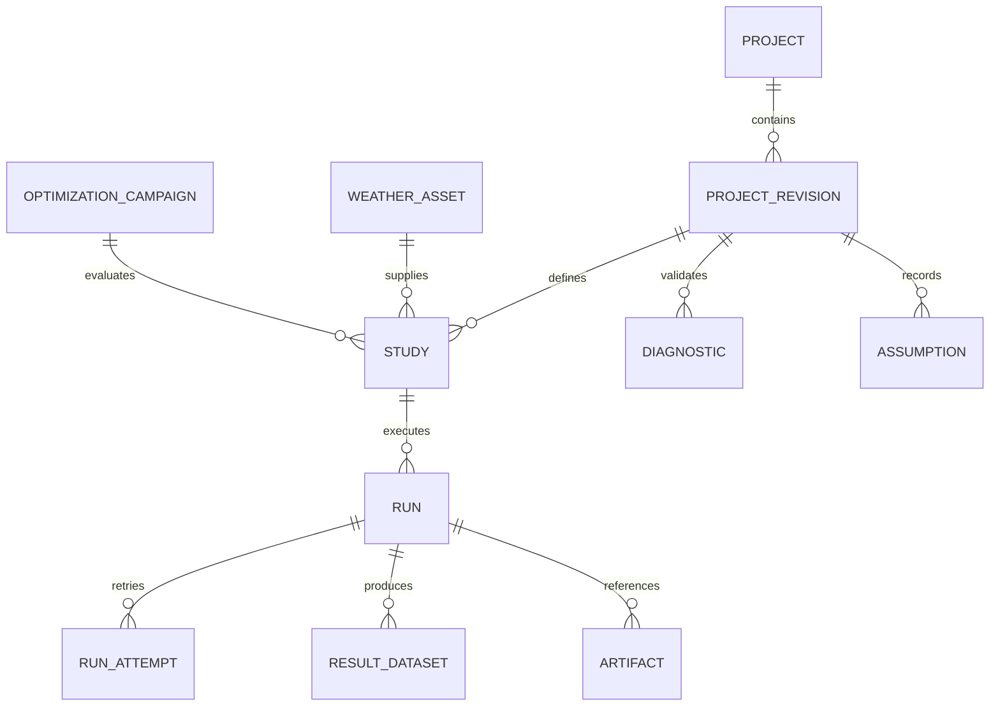
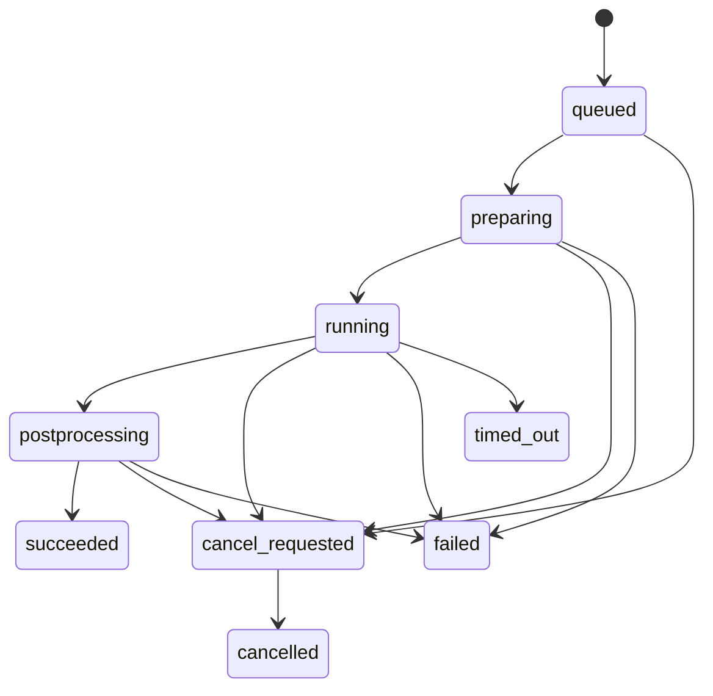

# HomePlanner building-performance architecture and implementation roadmap

**Status:** mixed delivery: existing local capabilities plus proposed extensions.

**Current implementation review (17 September 2026):**
[implementation gaps and next-delivery plan](building-performance-gap-review.md)
records the current code evidence, integration defects and R0-R7 acceptance
gates. Read it before treating an item below as absent, delivered or required.
Keep the SVG/Three.js editor and one structured project authority; Blender is
optional authoring/conversion/render tooling. React and the hosted
FastAPI/database/broker topology are choices, not prerequisites for the local
editor or the first bounded external-engine fixture. The earlier AI-generation
product goal and explicitly approved map-planning scope remain unchanged.

**R0 remediation completed:** production startup, observer diagnostics, atomic
provenance/history, owner-qualified drafts, exact import/New Project handling,
supported shared 2D/3D actions, balcony identity/projection, complete-project
JSON controls and all twelve calculation-reference packages are now integrated.
The gap review records the passing production-browser and numerical-reference
evidence. R1-R7 engine-readiness, simulation and interoperability work remains
planned; this completion adds no Blender or external simulation backend.

**Subsequent approved utility slice:** the second review also delivered
[live local Python density and solar calculations](python-analysis.md),
including explicit location-weather retrieval. These use PsychroLib and pvlib
through the existing Flask service. They are not the whole-building energy
compiler, Radiance workflow, coupled thermal/CFD, or generic job platform
described later in this roadmap. Programme Apply/Enter, result-restoration,
stair representation and concise 3D layer corrections are recorded in the
updated gap review.

**Scoped delivery amendment:** the local workbench now includes conceptual
architectural/structural sheets, elevations/sections, plumbing/drainage drawings,
native reduced-model airflow and light studies, and coordinated document packages.
See [coordinated packages](coordinated-package.md),
[airflow meanings](airflow-visualizer.md) and [light meanings](light-visualizer.md).
These reuse the existing project and explicit physical inputs; they do not
implement the AI candidate pipeline, map-provider integration, CFD, validated
lux/daylight-factor analysis, structural engineering or hydraulic design proposed
below. The dated baseline observations and wider roadmap remain historical/planned,
not a claim of shipped simulation-engine parity.

**Website organization:** [the two-mode website organization plan](website-organization-plan.md)
defines Homeowner and Expert journeys, navigation, existing-feature destinations,
shared project state, responsive behavior and incremental UX delivery.

**Confirmed scope decision (10 September 2026):** the user chose “Include it in
the roadmap for now” for the Google map location picker and shared
10,000-per-month usage limiter. Both are persisted planning requirements only;
this decision does not authorize application implementation or Google service
activation. The shared limiter's per-SKU accounting, safety headroom and
fail-closed behavior are specified below.

**Historical baseline evidence date:** 10 September 2026, repository `3f909d2`.
Current dirty-checkout observations are in the 17 September review above.

**Primary product outcome:** a user asks **“Create a 3-bedroom 1800 sq ft house
for Hyderabad climate”** and receives ranked, constrained, editable design
candidates with transparent assumptions and evidence.

**Confirmed example requirement:** 1800 sq ft is **total built-up area including
walls, summed across all floors** (approximately 167.23 m²), not carpet or plot
area. The number of storeys remains unspecified.

**Additional primary journey:** “Design a 3BHK in this 23×45 plot facing east /
north-east,” including measured or approximate bearing/deviation and neighboring
obstructions. Dimension units, frontage/access and context are first-class inputs.
This is a separate brief from the 1800 sq ft example unless the user combines them.

**Scope:** work backwards from that AI-assisted design outcome. Building-performance
modeling workflows associated with DesignBuilder are enabling capabilities, not
the initial product or a promise of parity. This document changes no application code.

Repository references below are relative to this document; historical line
ranges refer to the inspected baseline, not the current checkout. External
sources are listed in Section 8.6. **Observed** means verified in the stated
source/review scope; **proposed** requires implementation and validation. The
original 10 September document inspected test sources without running them.
The newer review lists its own narrower checks and observed failures; neither
is a full-suite or scientific-validation claim.

## 1. Overview

The primary pipeline is:

**Natural-language brief → structured requirements and clarification → bounded
constraint-based candidates → semantic geometry → deterministic validation →
climate/performance screening → ranked editable designs and reports.**

**Optional deeper analysis:** an accepted candidate revision → validated analysis
model → pinned engine adapter → isolated simulation → evidence-backed reranking.
An annual simulation is not required to deliver the first useful generated plan.

The LLM interprets intent, proposes alternatives and explains evidence. It is
**not** the authority for geometry, area accounting, constraint satisfaction,
climate physics, or compliance. Deterministic code validates those claims.
Missing plot information leads to an explicitly site-unconstrained concept,
not an invented site-feasible house.

Recommended choices:

1. Keep the vanilla editor, bridge, local persistence, SunCalc, and Three.js
   working. Finish current integration and action parity first. React islands
   are an optional implementation choice for new complex workflows, not a
   required rewrite or simulation dependency.
2. Reuse the existing project and registered snapshot/projection APIs. Add
   versioned study semantics and immutable engine-independent analysis bundles;
   no second writable project is needed for the first supported analysis.
   A new semantic authoring format is a later capability decision for geometry
   the existing editor cannot represent, with explicit migration and recovery.
3. Deliver constrained AI-generated editable floor plans first, using a reviewed
   brief and the existing rectangular model/editor. Progress from inexpensive
   climate screening to optional engineering-grade workflows as they pass tests.
4. Use **direct, narrowly scoped EnergyPlus epJSON compilation for Phase 2**.
   Time-box a Honeybee/OpenStudio compatibility spike before finalizing the
   supported engine bundle. Do not maintain two production energy exporters.
   Honeybee/Radiance recipes remain a strong Phase-3 workflow choice.
5. Separate control from engine execution. First prove a bounded local runner,
   immutable input/output artifacts and the adapter contract; select a
   compatible OS/runtime rather than automatically installing containers.
   For hosted multi-user execution, the proposed FastAPI/durable queue/
   PostgreSQL/object-storage profile below adds ownership, concurrency and
   operational controls. Keep the same logical contracts without requiring
   that full topology for every local user.
6. AI-assisted generation is a first-release capability. Later autonomous
   optimization adds depth and budgets; it is not the first appearance of AI.
7. Distinguish **engine-computed**, **derived**, **heuristic**, **assumed**,
   **incomplete**, and **validated-for-a-specific-fixture**. None is synonymous
   with measured building performance or regulatory certification.

### 1.1 What “DesignBuilder-like” should mean

The proposed “70–90% overall,” “100% in many disciplines,” “70–90% CFD,” and
“40–60% WUFI-class moisture” figures do not yet have a defensible denominator,
edition/version comparison, test set, or usability assessment. They are
aspirations, not engineering acceptance criteria.

An engine's published capabilities are not HomePlanner's implemented or validated
capabilities. EnergyPlus integration does not automatically provide every HVAC
system, a usable zoning editor, compliance workflows, or calibrated predictions.
Similarly:

- **pvlib** models solar position, irradiance and PV systems; it is not an
  arbitrary-building-mesh shadow engine. Geometry-dependent shading must be
  supplied by a separate, validated workflow.
- **Radiance** integration needs optical properties, sky/weather preparation,
  sensor grids, occupied-hour definitions and numerical settings. Annual
  daylight metrics and viewpoint-based glare are separate workflows.
- **pythermalcomfort** computes indices from required environmental and occupant
  inputs. It does not infer indoor airspeed, clothing, or mean radiant temperature
  from room geometry.
- **PsychroLib** supplies psychrometric properties. Condensation screening also
  needs surface temperatures; mold screening needs a justified exposure/material
  response model. This is not WUFI-equivalent transient moisture transport.
- **Airflow networks are not CFD.** Optional external CFD requires meshing,
  boundary conditions, turbulence choices, convergence and validation work that
  is outside the initial roadmap commitment.

## 2. Requirements Analysis

### 2.1 Functional requirements and explicit limits

| Requirement | Proposed supported scope | Boundary / dependency |
|---|---|---|
| Brief to editable house | Parse bedroom count, area intent and location; clarify missing constraints; generate, validate, rank and accept alternatives | Primary product; requires deterministic generation and editor adoption, not annual simulation |
| Site-constrained 3BHK | Dimensioned plot polygon, units, frontage/access, non-cardinal bearing, setbacks and neighboring context; require three bedrooms plus living/hall and kitchen | No implied units, missing-obstruction clearance or automatic link to the 1800 sq ft brief |
| Clarify vs assume | Confirm area basis, plot/buildable envelope, storeys, north/access, household program and preferences | Missing site inputs permit only labeled conceptual output |
| Draw/import buildings | Existing rectangular room editing first; later polygonal spaces, GLB/OBJ context and a declared IFC subset | A visible mesh is not a valid thermal model |
| Energy analysis | Rooms, zones, envelope, weather, schedules, gains, infiltration, ideal-loads study; then a small real-HVAC template library | Ideal loads are heating/cooling demand, not equipment electricity consumption |
| Location to simulation weather | Address geocoding **or** direct latitude/longitude **or** explicitly requested browser location → one confirmed `SiteLocation` → provider eligibility/fetch → immutable cache → validated EPW | All paths require plot-location confirmation; device location need not be the plot, and no location point establishes facing |
| Sun and shading | Retain local quick screening; add whole-building inter-storey geometry and annual studies | Existing per-floor shadows are not complete whole-building shading |
| Daylight and glare | Point-in-time illuminance → annual DA/UDI/sDA/ASE → selected-view glare | Each metric needs a separate definition, input contract and acceptance fixture |
| Comfort | PMV/PPD and adaptive comfort under documented applicability | No substitution of outside wind for indoor occupant airspeed |
| PV | Array placement, irradiance, temperature, DC/AC yield and declared losses | Geometry shade and electrical mismatch need explicit treatment |
| Ventilation | First explicit infiltration/ventilation schedules; later EnergyPlus AirflowNetwork | CFD and detailed pollutant transport deferred |
| Moisture | Surface condensation and exposure screening with quality flags | No automatic claim of hygrothermal or health-risk equivalence |
| Economics | Scenario costs, energy tariffs, discounted cash flow and sensitivity | No guaranteed savings; prices and incentives are dated assumptions |
| Rules | Versioned advisory checks with applicability evaluation | Unknown applicability cannot produce “compliant” |
| AI and optimization | Intent parsing and constrained generation first; simulation-backed campaigns later | No unbounded loops, arbitrary code execution, or unapproved expensive runs |
| Results | Time series, summaries, spatial overlays, comparisons and downloadable evidence | Every result traces to one immutable revision and run manifest |

### 2.2 Non-functional requirements

- Preserve offline 2D and opt-in online behavior. Never automatically upload
  existing projects when a backend becomes available.
- Make geometry, assumptions and transformations auditable; preserve source files.
- Keep the UI responsive while imports and simulations run elsewhere.
- Provide durable run state through API restarts, worker crashes and duplicate
  delivery; support cancellation and quota enforcement.
- Reject unsupported models explicitly instead of silently simplifying them.
- Use least-privilege access, bounded input processing and project-scoped artifacts.
- Reproduce runs using pinned inputs and software. Quantify any numerical
  nondeterminism rather than promising cross-platform bitwise equality.
- Retain current local regression coverage and add independent simulation
  validation. Test existence alone is not evidence of scientific validity.

### 2.3 Weighted feature acceptance matrix

The following weights are a **proposed product prioritization**, summing to 100,
recentered on brief-to-editable-design success.
They are not a measured comparison to DesignBuilder. Ratify them with intended
users and a named comparison-product edition/version before publishing a score.

| Feature family | Weight | Minimum evidence for acceptance | Planned gate |
|---|---:|---|---|
| Brief clarification and bounded AI generation | 22 | Intent/area ambiguity fixtures, required-room counts, safe proposal flow and editable candidates | GA |
| Geometry, semantics and authoring | 20 | Stable IDs, area ledger, constraints, editor adoption; later full shells/imports | GA–G1 |
| Ranking, editing, reports and reproducibility | 14 | Transparent rank evidence, candidate adoption/save/reopen, stale-result handling | GA–G1 |
| Weather, materials and operations | 8 | Versioned input library, time/unit checks, acknowledged assumptions | GA–G1 |
| Energy and supported HVAC | 12 | Independent reference runs, requested outputs, demand/consumption distinction | G1–G2 |
| Sun and shading | 6 | Analytic obstruction fixtures and multi-storey cases | GA–G3 |
| Daylight and glare | 5 | Annual-grid and viewpoint-specific benchmark evidence | G3 |
| Thermal comfort | 3 | Published function cases and applicability masks | G3 |
| PV | 2 | Unshaded reference and independently checked shading/loss inputs | G3 |
| Ventilation | 3 | Network conservation and coupled test cases | G4 |
| Condensation / moisture screening | 1 | Surface-state/exposure validation and explicit limitations | G4 |
| Economics and advisory code checks | 2 | Reviewed formulas, rule sources, version/applicability checks | G4 |
| Advanced autonomous optimization | 2 | Bounded, reproducible campaigns with approval and audit records | G5 |

For a real acceptance register, split each family into atomic workflows with
assigned weight shares, an owner, applicability, implementation state, fixture,
reference result, usability test and evidence link. States are `not-started`,
`implemented`, `verified`, and `accepted`; report these separately.

An optional **accepted-scope score** is
`100 × sum(accepted applicable weights) / sum(all applicable agreed weights)`.
Unfinished applicable items stay in the denominator. Explain exclusions publicly;
do not drop difficult items merely to raise the score. CFD and transient
hygrothermal transport are explicitly uncommitted extensions and must remain
visible as exclusions. No current score is asserted here. GA is the first
generation acceptance gate; G1–G5 measure later analysis depth. Delivering the
headline request depends on GA, not on completing every weighted discipline.

### 2.4 Example request, clarification flow and acceptance journey

> **User:** “Create a 3-bedroom 1800 sq ft house for Hyderabad climate.”

The product retains **exactly three requested bedrooms**, a Hyderabad
location/climate intent, and the user's confirmed area meaning: **1800 sq ft
total built-up area including walls, summed across all floors**.
`1800 ft² × 0.09290304 = 167.225472 m²`, displayed as **approximately 167.23 m²**.
This is neither carpet area nor plot area nor 1800 sq ft per floor. Storey count
and per-floor allocation remain unresolved; the total does not determine them.

The interactive flow below is a design requirement, not questions being asked
of the user in this planning task. It applies to other ambiguous prompts too.
For this example, retain the confirmed area basis, wall inclusion and all-floor
scope without asking again; clarify only still-unresolved details.

| Clarification step | Required capture | Safe behavior if unanswered |
|---|---|---|
| Area meaning | For new ambiguous briefs: built-up vs usable/carpet and total vs per-storey. For this example: built-up including walls and all-floor total are confirmed; target vs maximum, allowed deviation and treatment of stairs/balconies/parking still need a policy | Preserve confirmed values. Keep only unanswered details unresolved; offer assumption branches only with explicit “explore concepts” consent |
| Plot and buildable space | Plot dimensions/polygon and units, road/front access, confirmed setbacks/easements and any buildable-envelope restrictions | Generate a hypothetical envelope, never claim fit on a real site or inherit optimizer permission estimates as facts |
| Storeys | Requested number, per-floor allocation, stair/access needs and any future extension | Propose one storey for review; mark assumed, not extracted from the prompt |
| Site/orientation | Confirm site/pin, true north, access edge, terrain and surrounding obstructions | Hyderabad city coordinates are a climate proxy only. Unknown north/context limits shading and wind conclusions |
| Household program | Three bedrooms; bathroom count/access, living/dining/kitchen, utility, storage, parking, accessibility and furniture requirements | Propose supporting-room counts/sizes explicitly; never silently drop a bedroom to make packing fit |
| Priorities | Privacy, circulation, climate response, cost, outdoor space; optional Vastu preferences | Use visible, editable soft priorities; do not presume Vastu or treat it as climate physics |
| Climate inputs | Regional proxy vs user-reviewed weather, natural ventilation/AC intent, occupancy | Permit qualitative/sun-position screening with disclosed limits; no fabricated weather, indoor temperatures or annual savings |

Area definitions are versioned product accounting policies, not claims to be a
particular statutory definition. Gross built-up and carpet ledgers must show
what is included/excluded and avoid summing overlapping wall allowances.
Deviation is checked against the user's chosen bound; display rounding does
not establish an acceptance tolerance.

**Example acceptance journey:**

1. Show the extracted brief and confirmed **1800 sq ft total built-up including
   walls across all floors**, with evidence and remaining unresolved fields.
   Do not reopen the settled area-basis question.
2. Storeys are still unspecified. Offer a **single-storey conceptual branch**
   for review if plot details remain unavailable; use it only after explicit
   acceptance, not as a fact already supplied by the user. Any later multi-storey
   branch must share the same 1800 sq ft total, not multiply it by floor count.
   A proposed supporting program might be one living/dining space, one kitchen,
   two bathrooms and circulation/storage, all editable assumptions, not facts
   derived from “3-bedroom.”
3. Generate a bounded, diverse shortlist (product target: three distinct valid
   alternatives when the supported search finds them). Each candidate retains
   exactly three bedrooms, its envelope/area ledger, circulation and opening
   geometry. The ledger includes walls once and sums built-up area across floors
   against the confirmed total and agreed deviation policy. Do not duplicate one
   candidate to meet a presentation quota.
4. Deterministic checks reject overlaps, inaccessible rooms, invalid doors,
   omitted required spaces and out-of-bound areas. If no valid plan is found,
   report conflicts or “none found within the search budget”; a heuristic
   failure is not proof that the brief is mathematically infeasible.
5. Rank survivors by the declared soft preferences with an explanation table.
   Label orientation alternatives and solar/ventilation proxies as screening.
   With missing plot data every card says **“Conceptual — plot fit unverified.”**
6. Accept one candidate into a **new editable project**, inspect/move a room or
   window in the existing editor, undo, save/export and reopen it. Changed
   geometry invalidates its prior constraints/ranking; rerun checks rather than
   keeping the old “valid” badge. Preserve the brief and original candidates.
7. When plot/access/north constraints are supplied, rerun generation/validation.
   Only candidates that pass all declared site checks may say **“Fits supplied
   site constraints”**; this still does not mean sanctioned or construction-ready.
8. Optionally confirm envelope/occupancy/weather/HVAC assumptions and approve
   simulation of selected revisions. Enter coordinates directly, geocode an
   address, or explicitly request browser location; confirm the chosen **plot**
   location on the map, review PVGIS/POWER availability and quality, and pin a
   validated EPW asset or select an uploaded/station alternative (Section 4.4).
   Attach engine-computed evidence and rerank
   only comparable results. The editable design remains useful without this step.

**Primary success measure:** the user can trace the headline brief to an accepted,
editable three-bedroom design, understand the area and assumptions, compare
alternatives, and see exactly which site/performance claims remain unverified.
An attractive image, an LLM-written layout description, or an energy chart alone
does not satisfy the outcome.

### 2.5 Site-constrained example: 23×45, east / north-east, neighboring buildings

> **Separate user brief:** “Design a 3BHK in this plot with dimensions 23×45,
> facing east / north-east,” with an angle of deviation and neighboring buildings
> blocking sides.

Interpret **3BHK as three bedrooms, a living/hall space and a kitchen**, not
merely three generic rooms. Bathrooms, circulation, utilities and other needs
remain explicit program requirements/clarifications. “East / north-east” may
mean alternatives or uncertainty; do not choose one on the user's behalf.

The interaction must capture:

1. **Dimension units and geometry.** `23×45` contains no units. Ask whether feet,
   metres or another unit, which dimension is the frontage, and whether a
   rectangle is intended. Show a dimensioned polygon with stable edge IDs and
   editable vertices; two lengths do not describe an arbitrary irregular plot.
2. **Frontage, road and access.** Select the actual boundary edge(s) abutting a
   road, road width/source if used, desired entry point(s), and the facade that
   “faces” the named direction. A road running north–south is not the same as an
   east-facing facade. Corner plots may have multiple frontage/access edges.
3. **Bearing and deviation.** Use clockwise azimuth from true north:
   `0° = N`, `90° = E`, `180° = S`, `270° = W`. A named E or NE supplies a
   nominal `90°` or `45°`, **not a measured bearing**. Ask for measured azimuth
   or a deviation relative to the explicitly named baseline: clockwise positive,
   anticlockwise negative. For example, NE +12° clockwise is 57°; E −7°
   anticlockwise is 83°. Record approximation/uncertainty and north reference
   (`true`, `magnetic`, `unknown`); do not silently treat compass north as true.
4. **Buildable constraints.** Capture setbacks by identified edge, easements,
   allowed height/storeys and any FAR/coverage constraints with their definitions,
   source, approval and applicability. User-approved constraints can govern a
   study without establishing verified legal compliance. Unknown rules remain
   unknown, not zero setbacks or unlimited height.
5. **Surrounding context.** Let users draw/edit neighboring footprints and enter
   heights, base elevations and measured offsets/distances from plot boundaries.
   Record visible neighbor windows where available. Capture each side's coverage
   as `surveyed`, `partial`, `unknown`, or explicitly `assumed-clear`; an empty
   list is not evidence that no obstructions exist.

**Illustrative feet branch only, not an inferred unit:** if the user confirms a
rectangular **23 ft × 45 ft** plot, its area is **1035 ft² (about 96.15 m²)
before setbacks**. This does not inherit the other example's 1800 ft² target.
If the user explicitly combines the requests, 1800 ft² of total built-up area
including walls cannot fit on one floor wholly inside that 1035 ft² plot.
It may need multiple storeys, but permitted height, FAR/coverage, setbacks,
stairs/access and the actual buildable envelope can still make it infeasible.
Do not enlarge the plot, omit setbacks, split required rooms out of the program,
or promise that two storeys will work. A raw built-up/plot ratio is not a verified
statutory FAR calculation.

**Acceptance journey:**

- Confirm units/program and show the dimensioned site, selected frontage/entry,
  facade outward-normal arrow and north-reference/deviation controls.
- Request unresolved hard constraints or let the user approve a clearly bounded
  assumption scenario. Preserve the real plot dimensions even in assumption mode.
- Generate candidates inside the supplied buildable polygon, with valid 3BHK
  counts/access and the permitted height/storey envelope. Initially support a
  rectangular plot with arbitrary bearing; irregular-site generation is a
  separately gated extension, not a hidden conversion to a larger rectangle.
- Edit a neighbor's position/height or the bearing and recompute site/context
  screening. Show changed exposure/view/privacy evidence and ranking provenance;
  do not guarantee every edit must change the ranking if the score is unaffected.
- Offer an editable shortlist and a **site feasibility report**: each supplied
  hard constraint, source/assumption, achieved value, margin/violation, unknown
  applicability, relevant entities and actionable next step.
- Distinguish invalid input (e.g. conflicting dimensions/bearings), a proven
  constraint conflict (e.g. the one-floor area bound above), unsupported geometry,
  and a budget-limited search that found no candidate. Explain which input or
  approved constraint could be reconsidered; any relaxation needs user consent.

Climate-aware does not mean “all sides should have windows.” A neighboring wall
can obstruct solar access/daylight or a view, while nearby windows may create
privacy trade-offs. Assess these against the actual context and uncertainty.
No obstruction-based score establishes CFD wind speed, cross-ventilation rate
or indoor comfort.

## 3. Component Architecture

### 3.1 Historical baseline inventory

This table describes the 10 September baseline. The
[current capability matrix](building-performance-gap-review.md#1-current-implementation-versus-proposed-capability)
supersedes its absent-feature statements: native airflow/light studies,
registered drawing snapshots, coordinated sheets and reservation-aware geometry
have since been added, while some cross-page/3D wiring remains incomplete.

| Component / evidence | Observed responsibility and contract | Reuse / limitation |
|---|---|---|
| [`README.md`](../README.md), [`index.html`](../index.html):1114–1178, 1283, 1769, 1808, 2440, 5678–5691 | Static application; inline plot-rule/optimizer and room-layout code, `roomManualLayouts`, explicit script load order | Preserve plot/local workflows. The inline generator and DOM remain coupled; no backend or app build step is currently required |
| [`index.html`](../index.html):1808–1866, 2380–2483, 2589, 2754, 4843–4847 | `roomPlannerConfig` reads room counts/ranges, passive/Vastu flags and wind; `roomPackAttempt` scores placement; `roomPackProgram` chooses among four heuristic attempts; manual layouts override generated positions | Starting point for constrained candidates, **not existing AI**. Currently selects one best plan and can retain unmet requests; neither target gross area nor all required rooms is thereby guaranteed |
| [`planner-model.js`](../planner-model.js):163–245, 403–472 | Browser `HomePlannerModel` and CommonJS API; schema-1 validation, project creation and `buildScene(context, project)` | Reuse validation philosophy and fixtures. Scene is a derived rectangular floor representation, not an engine-ready volume model |
| [`planner-model.js`](../planner-model.js):237–258, 790–858 | Local-to-ENU transforms; floor-namespaced entities, shared walls, openings, solid wall sections, union areas, unresolved-opening diagnostics | Useful geometry foundation. Scene heading is derived from cardinal frontage; no canonical general boundary representation or complete thermal adjacency |
| [`planner-bridge.js`](../planner-bridge.js):30–114, 266–312, 352–395 | `createController(adapter, Model)`, immutable snapshots, `execute`, `subscribe`, selection, import/export, rollback, undo/redo | Best migration seam. Active-floor data are mirrored at top level and in floor records; DOM adapter captures/restores legacy controls |
| [`planner-editor.js`](../planner-editor.js), [`tests/planner-editor.test.cjs`](../tests/planner-editor.test.cjs):35–109 | Editor helpers validate numeric commands, resolve floor-scoped selection and preserve unedited coordinates | Wrap rather than rewrite first. Current commands are not a generic polygon/BIM editor |
| [`planner-3d.js`](../planner-3d.js):20–39, 176, 354–395 | Vendored Three.js `0.185.1`, generated wall/aperture meshes, selection and sun preview; ENU maps to Three as `(east, up, -north)` | Retain renderer and picking. Preview slab/finish/glass thickness constants are not authoritative physical assemblies; HTTP/HTTPS is needed |
| [`sun-model.js`](../sun-model.js):70–115, [`tests/sun-model.test.cjs`](../tests/sun-model.test.cjs):10–82 | SunCalc-backed position with IANA time conversion, ambiguous/nonexistent local-time handling and seasonal sampling | Retain preview behavior and time tests; bind authoritative analysis weather/time separately |
| [`planner-location.js`](../planner-location.js):6–34; [`tests/planner-location.test.cjs`](../tests/planner-location.test.cjs):5–33 | `HomePlannerLocation.detect` / CommonJS `detect`: one-shot `getCurrentPosition`, secure-context check, finite/range validation, accuracy and timestamp; explicit denial/unavailable/timeout errors | Reuse the detector, not a new tracking implementation. Plot-map confirmation, unified `SiteLocation` and dependency invalidation are additions, not existing guarantees |
| [`environment-data.js`](../environment-data.js):8–24, 125–150, 180–237 | EPW/JSON/Open-Meteo normalization, provenance, explicit units, null missing values and interval durations | Reuse contracts/test cases. EPW subset is not a lossless engine-weather export: keep original EPW bytes |
| [`building-physics.js`](../building-physics.js):89–123, 520–612, 655, 822–880, 961 | Pure `assemblyProperties`, `shadowAt`, `surfaceExposure`, `solveAirflow`, `simulateThermal` | Keep as explicitly labeled reduced-model screening, not EnergyPlus/Radiance replacements |
| [`environment-ui.js`](../environment-ui.js):407–428, 464–487, 744, 1097–1147 | Opt-in numerical scenarios and export; supplied pressure/thermal inputs and disclosures | Existing export explicitly is not an EnergyPlus input. Storeys are shaded separately; thermal state has no automatic weather/airflow/HVAC coupling |
| [`electrical-planner.js`](../electrical-planner.js):558–664, 896–897, 1121; [`tests/electrical-planner.test.cjs`](../tests/electrical-planner.test.cjs):124–200 | Per-floor electrical points, semantic anchors, suggestion acceptance and unknown-height handling | Preserve as a sibling workspace. Point schedules are not automatically appliance energy-load schedules |
| [`planner-storage.js`](../planner-storage.js):8–16, 103–138, 201–239 | IndexedDB `HomePlanner.local-projects`, database/record/project versions all 1; `projects` and `settings`; revision-checked document envelopes | Preserve existing database. Current readers reject schema 2; same revision/different content conflicts, not last-write-wins |
| [`planner-persistence.js`](../planner-persistence.js), [`tests/planner-storage.test.cjs`](../tests/planner-storage.test.cjs):36–108 | Opt-in local persistence controller, backup/import and complete project snapshots | Local revisions are browser-edit revisions, not server-authoritative history or multi-client merge |

Important existing limits:

- A project requires 1–100 floors and schema version 1; JSON import has a stated
  32 MiB limit with additional node/depth checks. These are not validated server
  upload/resource limits and must not be copied blindly.
- Default site is Hyderabad (`17.385`, `78.4867`, `Asia/Kolkata`); default wall
  height is `2.7432 m` and roof thickness `0.15 m`. Defaults are not observations.
- Room clear-carpet dimensions and physical wall allowances require a deliberate
  thermal-reference-plane policy. Extruding every drawn wall independently would
  duplicate partitions or leave invalid zone boundaries.
- A removed partition, door swing glyph, or window operability fraction does not
  by itself determine thermal zoning or current ventilation.
- No inspected runtime path invokes EnergyPlus, Radiance, pvlib, IFC processing,
  a cloud account, PostgreSQL, or a simulation queue.
- No existing Leaflet/MapLibre/Mapbox/Google Maps/OSM tile integration was found
  in the inspected JavaScript/HTML. Reuse `planner-location.js` for location input;
  a lightweight map-confirmation component/provider adapter is proposed new work,
  not an already installed capability.

### 3.2 Existing tests worth carrying forward

These are inspected examples, not a claim that all tests pass at this snapshot:

- `tests/planner-model.test.cjs:56–145`: pure browser/CommonJS API, schema
  roundtrip, future-schema rejection, nonfinite input and unsafe JSON rejection.
- `tests/planner-bridge.test.cjs:48–127`: selection without revision changes,
  transactional commands, rollback, independent floors and attachment remapping.
- `tests/planner-storage.test.cjs:45–108`: full environment/provenance retention,
  idempotent same-revision save, stale/divergent revision rejection.
- `tests/environment-data.test.cjs:42–103`: EPW end-of-interval timing,
  fractional offsets, leap days, radiation conversion, missing data, TMY source
  years, gaps and overlaps.
- `tests/planner-location.test.cjs:5–33`: detection only on invocation, returned
  device accuracy, denial/unavailable/timeout codes and insecure/invalid failures.
- `tests/planner-3d.test.cjs:67–133`: coordinate consistency and actual Three.js
  ray tests through apertures, sills and lintels.
- `tests/building-physics.test.cjs:673–740`: reduced thermal solver closed-form
  and refinement checks; supplied heat and energy conservation. These tolerances
  are solver-specific and must not become universal engine acceptance tolerances.

### 3.3 Target components and dataflow

The diagram below is the **optional hosted target**, not the prerequisite
topology for a local first engine run. The current review separates existing
browser capabilities, a bounded local execution profile and later hosted
operations. Blender remains outside the mandatory compiler path.



Begin as a **modular monolith plus worker**, not many microservices:

| Boundary | Responsibilities | Must not own |
|---|---|---|
| Intent gateway / brief service | Bounded LLM extraction, schema validation, clarifications and reviewed requirements | Authoritative room coordinates, constraint satisfaction or physical predictions |
| Candidate generator / ranker | Finite search, deterministic validation, diverse shortlist and evidence-backed scores | Silent relaxation of hard requirements or invented simulation results |
| Editor facade | Snapshot/command subscriptions, selection and diagnostic navigation | Engine configuration or authoritative server history |
| Geometry/domain library | Typed geometry, topology, IDs, units and deterministic transformations | DOM or queue orchestration |
| Import service | Untrusted file parsing, source preservation, supported-subset mapping | Silent generation of missing physical properties |
| Location / weather ingestion services | Unify address, manual coordinates and one-shot browser location after map confirmation; provider capability/coverage, bounded fetch, immutable artifacts and QA | Automatic device tracking, unconfirmed plot location, fabricated weather or context shade applied twice |
| Project service | Revisions, concurrency, ownership, assumptions, library references | Large simulation output blobs |
| Study service | Validation, engine/profile compatibility and dependency hashes | Direct simulation in request handlers |
| Worker/engine adapters | Compile/execute/parse within a bounded workspace | Arbitrary user shell commands |
| Results service | Units, metrics, quality, comparison contracts and provenance | Treating missing outputs as zero |
| Optimization service | Candidate budgets, constraints, objective records and proposals | Bypassing project/run approval policy |

### 3.4 Optional incremental frontend adoption

React officially supports adoption within an existing page [S1]. Use the
following sequence only if a concrete new workflow justifies React; existing
vanilla controls can use the same contracts without it. Apply it to the actual
bridge API rather than importing mutable DOM state into a second project store:

1. Establish a small `PlannerFacade` around `getProject`, `getScenes`, `execute`,
   `select`, and `subscribe`. Retain current commands and rollback behavior.
2. If selected, add an isolated React root for brief clarification, candidate
   comparison and acceptance; extend it to study setup, validation and results.
   Use a subscription adapter such as `useSyncExternalStore`; ensure stable
   snapshot identity and unsubscribe on unmount.
3. React owns only its root. Existing `planner-editor.js` owns its own DOM.
   Neither mutates the other's elements or maintains a second writable project.
4. Keep the existing Three.js renderer mounted through an adapter. Avoid loading
   a second incompatible Three instance; pin loaders to the selected version.
   React Three Fiber is optional, not a prerequisite.
5. Move material/schedule/zone inspectors next. Only later extract the inline
   generator from `index.html` into pure modules behind the same facade.
6. For legacy projects, publish a validated performance snapshot with
   `legacyProjectId`, `legacyRevision` and content hash. Subsequent legacy edits
   make that analysis stale and require explicit republishing/rebasing.
7. Once arbitrary semantic geometry is editable, make the canonical editor the
   sole writer for those projects. Do not round-trip unsupported polygons into
   rectangular legacy controls. Offer a read-only legacy reference where needed.

Future build tooling can package the analysis bundle while preserving the
current offline entry point. Full parity of `file://` with backend features is
not a requirement; display the distinction clearly.

### 3.5 Generation-first implementation path

Reuse the existing packing machinery as a **bounded heuristic strategy**, not as
a constraint solver with a completeness guarantee. Start with orthogonal,
single-storey cases the current editor can represent:

1. A small intent gateway accepts only the user's brief/approved minimal context,
   calls the selected LLM with a structured output contract, and validates the
   returned intent. Store evidence spans and unknowns; user review creates the
   authoritative `DesignBrief`. Keep credentials out of the browser and require
   consent for external model calls. Structured-form input works without an LLM.
2. Extract/wrap `makeRoomRequests`, `roomPackAttempt`, `roomPackProgram` and
   necessary helpers as a deterministic `generateCandidates(brief, context,
   budget)` interface. These functions currently depend on global wall values
   and DOM-derived configuration; make those dependencies explicit and test
   them before treating generation as a pure library.
3. Add explicit envelope/area constraints and bounded variations of shape,
   dimension ranges, ordering and orientation. Preserve promising alternatives
   rather than only `roomPackProgram`'s single winner. Generate stable candidate
   IDs and room IDs; record seed/order/configuration and deduplicate geometry.
   Keep orthogonal local room geometry initially, but add explicit arbitrary
   site/building transforms and bearing controls for the site-constrained GA
   release. Existing cardinal frontage is not enough for E/NE deviations.
   Irregular plot generation is a later polygon-envelope extension; do not
   accept or silently approximate geometry the editor cannot faithfully represent.
4. Independently validate every candidate against the reviewed brief. Existing
   score penalties and an `unmet` list are not hard-constraint enforcement.
   Required bedrooms cannot become optional to improve packing or climate scores.
   Hard constraints include 3BHK counts (bedrooms, living/hall and kitchen),
   permitted geometry, buildable boundaries/setbacks, approved height/area rules,
   area policy and declared circulation/access. Soft preferences include privacy,
   compactness, orientation and optional Vastu; a weighted score cannot cancel
   a failed hard constraint.
5. Screen survivors with available deterministic geometry and SunCalc/physics
   functions. Sun exposure, window/wall ratios, circulation and opening-path
   opportunities are useful proxies; wind direction requires evidence or a
   labeled scenario. No invented Hyderabad prevailing wind, cooling energy,
   daylight lux, indoor airspeed or comfort score. Compare a small explicit set
   of orientations if true north is not known. A scenario is not a correction
   to a measured site. Neighbor occlusion, view/privacy checks and opening-path
   proxies must record known versus unknown context and never become CFD claims.
6. Rank only comparable valid candidates using a versioned, visible policy.
   Report raw measures, normalized scores, weights, missing inputs and trade-offs.
   Missing climate data do not receive a neutral/zero value masquerading as a
   measurement. Show a partial ranking by available criteria or tied/Pareto
   candidates, and disclose unscored criteria.
7. A new **candidate-adoption adapter** is required: current `execute` supports
   edits, but not a general atomic `accept-generated-layout` command. Convert
   the selected supported candidate into the legacy controls/manual-layout
   representation and compile it through `HomePlannerModel.buildScene`.
   Verify that capture → restore → render retains the proposed layout and IDs,
   rather than regenerating a different “best” plan. Use a new project by default;
   replacement of current work requires explicit consent and rollback.
   Extend the shared view/analysis orientation path so local room coordinates
   retain the accepted non-cardinal world placement. Do not round to N/E/S/W
   during adoption. Verify the same transform in 2D, Three.js, sun screening and
   later engine compilation, including neighbor geometry.
8. Preserve candidate/brief/ranking provenance in a versioned local sidecar
   namespace, linked by project ID and accepted revision/hash. Keep exported
   legacy JSON compatible and offer a separate design-package export containing
   the legacy document plus sidecar. Later migrate this provenance into the
   canonical performance model/server records; do not put schema-2 documents
   in the existing schema-1 IndexedDB store.
   The sidecar must also persist the site polygon, units, bearing observations,
   transforms and context revision. A standalone legacy export that cannot
   preserve these must carry a clear loss-of-context warning; the design-package
   export is the supported lossless format for such candidates.

The generation loop is bounded by candidate count, elapsed time and LLM tokens/
cost. Use a browser worker for expensive local search; cancellation ends further
generation. The LLM proposes reviewed requirements/variations, **not executable
code, arbitrary solver parameters, or free-form coordinates accepted on trust**.
A future constraint-programming solver may replace the packing strategy when
fixtures show its value; selecting/installing one is not required for this slice.

## 4. Data Models

### 4.1 Canonical document and identity

For later authoring beyond the current supported geometry, the original
proposal is a separate `homeplanner.performance-project`, schema version `2`.
This is **not required for the first engine adapter** and must not introduce
a second writable copy of a schema-1 house. First extend compatible authored
study assignments and generate immutable analysis snapshots through the
existing coordinator. If richer authoring requires migration, explicitly hand
over authority and retain the original recovery document.

Schema 2 deliberately cannot be read by current schema-1 readers. Keep schema
version distinct from project revision, adapter version, engine version,
library version and result schema version.

```text
PerformanceProject
  format, schemaVersion, projectId
  site, buildings[], storeys[], spaces[], thermalZones[]
  surfaces[], openings[], shadingObjects[]
  materials[], constructions[], schedules[], systems[]
  analysisAssignments, assumptions[], sourceMappings[], extensions
```

- Persist opaque UUIDs for authored objects; names are mutable labels.
- Preserve current floor-scoped/source IDs as aliases in migration mappings.
  Migration assigns IDs deterministically within a retained migration namespace
  (for example, name-based UUIDs); ordinary new authoring may use random UUIDs.
  IFC `GlobalId` is a source identity scoped to the imported source/model, not
  automatically the global project identity.
- Moving/renaming an entity preserves its ID. Copying creates new IDs. Splitting
  or merging creates explicit lineage (`derivedFromIds`) and a reviewed mapping;
  never match solely by display name or array order.
- Compiler-generated faces have deterministic IDs tied to a source entity,
  operation version and decomposition key. Cache/result identity must not depend
  on unstable triangulation order.
- Dimensions, render meshes and calculated areas are derived views; revision
  content contains the governing geometry and its conventions.

### 4.2 Geometry, coordinates and topology

**Canonical world frame:** right-handed `(east, north, up)` in metres near a local
site origin. Keep WGS84 latitude/longitude in degrees and site elevation/datum
separately; do not use geographic degrees as Cartesian lengths.

Store the building-local-to-ENU transform explicitly. Define heading as clockwise
degrees from true north, with unit vectors/matrix as the authoritative transform.
Keep raw bearing observations with a `true`, `magnetic`, or `unknown` reference.
Do not interpret a magnetic/unknown observation as true-north placement: conversion
needs sourced declination, location/date and sign convention, or an explicitly
labeled orientation assumption. Preserve both raw and converted values and uncertainty.
Engine adapters translate their own north/azimuth conventions exactly once.
Preserve an imported georeferencing transform and chosen local-origin offset.

Current screen coordinates have downward-positive local Y and floor-centered
rotation (`planner-model.js:237–258`); Three uses `(east, up, -north)`. The legacy
adapter must apply these transformations explicitly. Do not infer north from
camera orientation, OBJ axes, or IFC placement alone.

| Entity | Required geometry / meaning |
|---|---|
| `Storey` | Explicit elevation, height and building ID; no automatic permission to build another storey |
| `Space` | Closed boundary shell, usage, storey ID, volume/reference-plane policy and zone assignment |
| `ThermalZone` | One or more compatible spaces sharing a modeled air/control state; setpoints and system references |
| `Surface` | Owning space, planar outer ring, inner void rings, orientation, type, construction ID and boundary condition |
| `AdjacencyPair` | Two opposing surface IDs, contact geometry, area agreement and split lineage |
| `Opening` | Host surface, polygon, aperture/door type, optical/thermal construction, operability and operating schedule |
| `ShadingObject` | Detached opaque/transmitting geometry, site-relative placement and optical assumptions |
| `MeshAsset` | Visualization/context geometry plus import transform; not implicitly a space |

Surface boundary conditions should be a tagged union: `outdoors`, `ground`,
`adjacentSurface`, or explicitly assumed `adiabatic`. A missing neighbor is
**unresolved**, not automatically adiabatic. Record sun/wind exposure separately.

Rules:

- Space and thermal zone are distinct. Initial supported mapping is one enclosed
  space to one zone. Multi-space zones require a later adapter capability gate.
- Create both sides of a shared thermal partition with reciprocal adjacency and
  opposite normals. Prevent double-counted external area.
- Reconcile inter-storey ceiling/floor contacts; split partially overlapping
  surfaces and retain mappings. No automatic exposed roof over every floor.
- Distinguish physical partition removal from analytical air boundaries and
  zoning decisions. Stairwells/atria cannot be guessed from independent floors.
- Rings must be simple, planar and consistently wound relative to outward normal.
  A geometric void is not automatically glazing. Each opening has one host and
  consumes a declared portion of the gross host area once.
- The canonical format may express polygon holes; each compiler must decompose
  them into its supported face representation and preserve area/source lineage.
  Unsupported shapes block compilation, not silently become bounding boxes.
- Use explicit dimensional, angular and area tolerances with units and
  scale-aware checks. A renderer's `EPS = 1e-7` is not a physical import tolerance.
  Any snapping/healing operation produces a proposed change and deviation report.

### 4.3 Physical and operational semantics

| Data | Contract |
|---|---|
| Materials | Density, conductivity, specific heat and thickness where relevant, units, source, revision and uncertainty; optical and vapor properties are separate |
| Constructions | Ordered outside-to-inside layers, surface applicability and thermal/optical definition; reversal rules for paired faces |
| Glazing | Named validated model family, U-value/SHGC/visible transmittance or layered definition, frame assumptions; no inference from Three material color |
| Schedules | Typed value/unit, timezone/calendar basis, weekday/weekend/holiday rules, intervals and limits; explicit library version |
| Internal gains | People, lighting and equipment definitions, sensible/latent and radiant/convective fractions where required |
| HVAC | Template/version, zone references, thermostat schedules, availability, sizing mode, capacities/efficiencies and supported controls |
| Ventilation | Outdoor-air requirements and infiltration mechanisms distinguished; opening operability is not an ACH value |
| Assumption | Object/property path, value/unit, source, status (`supplied`, `default`, `inferred`, `unknown`), author, acknowledged revision and uncertainty |

Initial ideal-loads studies must request both heating and cooling demand and
record ventilation/humidity/control assumptions. A later real-equipment study
must specify sizing/design conditions and fuel/electricity meters before claiming
consumption, EUI, utility cost or peak electrical demand.

### 4.4 Site, time and weather

- Store site coordinates, elevation/datum, IANA timezone and source confidence.
  Confirm the default Hyderabad site before compiling a real study.
- Preserve original EPW bytes, SHA-256, station metadata, license/source,
  classification (TMY/historical/etc.), import version and warnings. Existing
  normalized weather retains only selected fields and cannot reconstruct all
  EnergyPlus-required data faithfully.
- Represent normalized intervals with `start`, `end`, duration, measurement
  convention, values/units and missing flags. Preserve original EPW end-of-hour
  fields and local-standard UTC offset. UI civil time and DST are distinct.
- TMY source years are not a chronological observed series. Record explicit
  simulation-calendar mapping, leap-day treatment, holidays, start day of week,
  run period and engine weather interpretation.
- Require a complete supported annual EPW for the first annual-energy feature;
  partial files remain useful for local screening but cannot silently become
  complete annual studies. Missing weather, overlaps and location mismatch
  generate diagnostics; any repair is a separate versioned artifact.
- Design-day/DDY data for sizing have their own source/version. Annual weather
  is not by itself evidence that design-day sizing is appropriate.

#### 4.4.1 Python weather ingestion service

Proposed user-facing workflow:



The service has separate `SiteLocationService`, `GeocoderAdapter`, `WeatherProviderAdapter`,
`WeatherNormalizer`, `EPWAssembler/Validator` and `WeatherAssetRepository`
responsibilities. Run network fetch/conversion outside UI event handlers and
long API requests. It may use the durable worker/outbox machinery already planned;
weather fetching is a distinct job from an engine run.

**Three equivalent entry paths, one binding contract:**

- **Manual latitude/longitude:** accept explicitly labeled WGS84 decimal-degree
  fields. Validate finite latitude in `[-90, 90]` and longitude in `[-180, 180]`;
  reject missing, nonnumeric and out-of-range values without clamping or silently
  swapping fields. Do not geocode/reverse-geocode merely to accept coordinates.
  Show the map pin for explicit plot confirmation.
- **Browser location:** only a user click invokes the existing
  `HomePlannerLocation.detect()`. Its current implementation uses a one-shot
  browser request with `enableHighAccuracy: true`, a 10-second timeout and
  `maximumAge: 0`, returning `{latitude, longitude, accuracyM, timestamp}`.
  High-accuracy preference is not a precision guarantee. Require a supported
  secure context (HTTPS/localhost) and preserve explicit `insecure`, `unsupported`,
  `invalid`, and permission/unavailable/timeout failure states. Offer manual
  coordinates or address entry after failure; never repeatedly prompt or discard
  the previous confirmed site.
- **Address:** use the consented ambiguity-resolution flow below. A geocoded
  candidate, like a device result or typed coordinate, remains a proposal until
  the user confirms the actual plot pin.

The browser's current location may be the user's home, office or another city,
not the building site. Show device accuracy and observation time on the map and
require **“Use this as the plot location”** confirmation. Allow pin correction;
if moved, retain that it was manually adjusted and do not claim the device's
accuracy applies to the corrected pin. Poor accuracy can prompt correction but
must not be silently represented as a survey point.

**Lightweight interactive map confirmation — immediate next step:**

After any successful initial input (typed coordinates, an address candidate or
browser detection), open the same small, lazy-loaded map panel. Do not wait for
weather, parcel lookup, 3D geometry or a simulation backend to return before
letting the user confirm the site.

1. Center the map on the proposed coordinate with a sensible bounded zoom.
   For browser GPS, draw an initial accuracy circle at the original observation
   and show its `accuracyM`/time. The circle is positional uncertainty, not the
   plot boundary. Address results show available precision/bounds instead.
2. Place one draggable marker. Clicking/tapping the map relocates the proposed
   marker; display its current latitude/longitude alongside editable coordinate
   fields and provide keyboard-accessible placement. Keep an explicit distinction
   between the original observation and a corrected marker.
3. Show **“Confirm plot location”** and **“Cancel”**. A marker click/drag is not
   confirmation, and centering the map must not bind the project or start weather
   requests. Confirm validates the current coordinates and creates the reviewed
   `SiteLocation` revision through the existing planned confirmation contract.
4. On tile/authentication/network errors, show a clear map-unavailable state,
   retain the coordinates/draft and offer retry, address change or manual
   coordinate confirmation. Manual fallback requires an explicit acknowledgement
   that visual map confirmation was unavailable; record `confirmationMethod`
   (`map-pin` or `manual-fallback`) rather than claiming the map was viewed.
   Cancelling preserves the prior confirmed project site.
5. A successful confirmation can then offer weather retrieval and an **optional**
   “Define plot boundary” step. That separate tool traces a polygon, labels
   edge dimensions/units, reconciles user-supplied measurements and lets the user
   select road/frontage/access edges. It does not infer those edges from the pin.

**What the pin does not establish:** a point confirms site/weather coordinates
only. It does not identify a legal parcel, ownership, surveyed boundaries, plot
dimensions, setbacks, frontage, true-north facade azimuth or an unobstructed
neighborhood. Basemap outlines and imagery are visual references with possible
offsets/age gaps; a traced polygon remains an unverified sketch until reviewed
against supplied measurements/survey evidence. Do not infer a 23×45 parcel or
the 1800 sq ft built-up requirement from a click.

Use a small `MapConfirmationView` behind a `MapProvider` abstraction for loading,
centering, marker updates, accuracy overlays, attribution and error handling.
Select/pin a lightweight mapping component during implementation; no existing
map library needs to be replaced, and no full GIS stack is required for this
slice. Keep tile-provider configuration switchable and preserve manual operation
without a map library/network.

A standard OSM-derived basemap is **not satellite imagery** and does not guarantee
parcel boundaries or building completeness. Offer aerial imagery only through an
appropriately licensed provider, retaining attribution and capture-date/precision
information when available. Check terms for display, screenshots/reports,
tracing/derived geometry, caching and offline use; do not scrape imagery.

For public OSM raster tiles, follow the current tile policy [S26]: visible
attribution, appropriate client identification/Referer, server-directed caching,
no bulk download/prefetch and no availability guarantee. Public geocoding and
tile services have different policies; Nominatim approval does not authorize
unrestricted tile use. Use a contracted/self-hosted alternative when deployment
needs cannot meet public-service terms. Do not store raw addresses/site secrets
in page URLs or tile request parameters; review provider location-disclosure
implications because requested map tiles reveal the viewed region.

**Optional provider: Google Maps — not a vendor commitment.** Google Maps
JavaScript is a candidate for the custom click/drag-coordinate confirmation
panel, alongside other appropriately licensed providers. Select it only after
UX, terms, privacy and cost review. Maps JavaScript requires an API key and
enabled billing [S30]. Restrict any browser-visible key by allowed websites and
APIs; keep server-side geocoding credentials separate and appropriately restricted.
This is distinct from keeping genuinely secret provider credentials server-side.

Pricing reference dated **10 September 2026**, based on the official pages
provided for this planning update [S27–S29]. These are monthly free billable-event
allowances and the **first paid volume-tier rates**, not guaranteed future prices:

| SKU | India monthly free allowance | India first paid rate / 1,000 events | Global monthly free allowance | Global first paid rate / 1,000 events |
|---|---:|---:|---:|---:|
| Dynamic Maps | 70,000 | USD 2.10 | 10,000 | USD 7.00 |
| Geocoding | 70,000 | USD 1.50 | 10,000 | USD 5.00 |
| Autocomplete Requests | 70,000 | USD 0.85 | 10,000 | USD 2.83 |

India eligibility depends on the billing account **and primary usage being in
India**, under Google's eligibility terms [S29]; a Hyderabad plot alone does not
qualify the application. Account aggregation, SKU/event definitions, session
rules, applicable taxes and volume tiers must be checked before estimating the
bill. Do not count every map tile or marker drag as a Dynamic Maps event, or
assume one address entry necessarily produces only one autocomplete request.
Autocomplete is optional; explicit-submit address search is enough initially.

Free allowances are **not hard spending stops**. Enabled billable usage above
the allowance can incur charges. Define provider quotas where supported, backend
rate limits, request deduplication, monitoring and budget alerts; alerts alone
do not cap spend. Add application usage limits/fallbacks and test their behavior
rather than promising billing cannot exceed a budget.

**Mandatory HomePlanner monthly Google budget guard (planning requirement,
not yet implemented):**

If Google is enabled, HomePlanner must enforce a conservative default ceiling
of **at most 10,000 billable events per calendar month per enabled SKU**, even
if the account might qualify for larger India allowances. Dynamic Maps map loads,
Geocoding requests and any enabled Autocomplete SKU have **separate** budgets.
Do not pool them into one counter or assume every API request has the same SKU.
Unconfigured/new SKUs remain disabled until their event definition and ceiling
are approved. Keep autocomplete off initially unless needed.

Use a shared durable server-side `MonthlyUsageLedger` with atomic reservations
across all HomePlanner users, browser tabs/devices, API replicas and workers.
PostgreSQL transactions/row locking or a conditional atomic update can implement
the proposed ledger; process memory or per-user `localStorage` cannot protect
account-wide consumption. A paid Google integration requires this backend guard
before activation, even if other GA features still run locally.

```text
MonthlyBudget
  billingScopeId, provider, sku, periodStartUTC, periodEndUTC
  providerTimeZone, cap, safetyHeadroom, externalUsageReserve, policyVersion
  consumedOrUncertain, outstandingReservations, reconciliationWatermark

UsageReservation
  id, billingScopeId, sku, billingPeriodId, idempotencyKey
  eventKind, maximumUnits, status, createdAt, dispatchDeadline
  dispatch/settlement evidence, callingProject, audited adjustments
```

Default the nominal cap to 10,000, with configurable **positive safety headroom**
(illustrative initial policy: 1,000 events, allowing no more than 9,000 app events
when no other usage is reserved). The administrator may lower limits, disable a
SKU or increase headroom; raising the ceiling above the approved conservative
policy requires an explicit audited cost-policy change, never automatic India
eligibility detection. Validate against the currently verified free allowance;
the smaller approved limit governs.

An atomic admission check includes all exposure:

`consumedOrUncertain + outstandingReservations + externalUsageReserve
+ safetyHeadroom + requestedMaximumUnits <= effectiveCap`.

Reserve **before** every potentially billable provider request or map instance
creation/recreation. Never increment a counter only after success. For server
geocoding, admission precedes dispatch. For the browser map, the application must
obtain and activate a reservation before any billable map initialization/loading
path; a denied reservation prevents that path from executing. Reuse a single map
instance/viewport where permitted instead of rebuilding it on each marker change.
Map dragging itself does not automatically consume another map-load reservation;
the adapter follows the selected SKU's actual billing-event rules.

Reservation behavior must prevent crash/retry undercounting:

- Creation is idempotent for one logical operation and parameter fingerprint;
  reuse with different inputs is rejected. It cannot authorize unlimited reloads.
- State transitions are atomic: `reserved → dispatched/uncertain → settled`.
  Before network dispatch or releasing browser initialization permission, durably
  mark potential consumption. A lost response, tab crash or missing browser
  acknowledgement remains **charged conservatively**, not refunded automatically.
- A second actual provider call/map creation on retry needs new reserved units,
  unless there is reliable evidence the original event was never dispatched.
  Logical idempotency must not conceal multiple billable attempts.
- Release only reservations proven undispatched. Expiry alone after permission
  was issued is not proof of non-use. At period boundaries, short-lived dispatch
  grants are revalidated and re-reserved in the correct month before use; hold
  uncertain boundary events conservatively until reconciled.
- If the ledger, policy, server clock/period determination or transaction result
  is unavailable/ambiguous, **fail closed for billable Google actions**. Keep the
  design editor and manual-coordinate confirmation usable.

**Billing period:** Google's official pricing overview [S31] says free usage
resets on the first day of the month at **midnight Pacific US time**, and usage
is aggregated across projects linked to the billing account. Use a versioned
provider period policy corresponding to `America/Los_Angeles`, with DST-aware
boundaries stored as UTC instants. Do not reset by device time, Hyderabad
midnight, a rolling 30-day window, or a fixed UTC−08:00 offset. Verify this
provider policy against official documentation/account terms at activation and
on changes; retain old-period ledger rows for audit rather than zeroing counters.

**Operational behavior:** show near-limit alerts at configurable thresholds
(e.g. 70%, 85%, 95% of usable budget), remaining app allocation and the relevant
period. At cap or guard outage, stop new Google maps/geocoding/autocomplete and
offer manual coordinates/address editing without dispatch; another already
approved provider may be offered only under its own terms/limits. Do not switch
to another Google key/project to evade the cap. Admin controls include immediate
disable, limit/headroom changes, reconciliation and audited corrections, with
least-privilege access. A per-minute/per-user abuse throttle is **additional**:
it limits bursts, not monthly expenditure.

**Limits of enforcement:** a reservation endpoint/token controls HomePlanner's
cooperative code paths, **not Google's acceptance of direct calls with a
browser-visible API key**. A client could bypass it, and other apps sharing the
billing account may consume the same free allowance. Apply Google API/website
key restrictions, supported provider quotas, separate restricted server keys,
account-wide monitoring and operational API/key disable controls as defense in
depth [S30–S32]. Dedicated project/key attribution helps, but another project
on the same billing account does not create another free allowance.

Reconcile the conservative ledger with Google usage/billing reports by SKU and
billing scope, allowing for reporting lag and differences between request quota
and billable-event counts. Do not subtract delayed usage reports from current
exposure or refund uncertain events merely because they are not yet visible.
Reserve for other applications/unreconciled usage; freeze/reduce admissions on
unexplained excess. This protects app-mediated usage but is **not a guarantee of
zero Google charges** when browser-key bypass, other-account usage or reporting
lag exists. Budgets/alerts alone are not hard stops; supported Google quotas
and the internal admission guard both need explicit configuration and testing.

Google Maps Embed's unlimited-free offering is not equivalent to a custom map
component exposing click coordinates and a draggable confirmation marker.
Do not substitute an embed without verifying the interaction contract. The
browser `navigator.geolocation` path uses the browser's Geolocation API; it
does **not** require purchasing Google's separate Geolocation API SKU.
Recheck official pricing/terms at provider selection and before deployment;
retain the map-provider abstraction so this optional choice stays reversible.

```text
SiteLocation
  id, revision, coordinateReference="WGS84", latitude, longitude
  entryMethod (manual-coordinates | address-geocode | browser-geolocation)
  confirmationStatus, confirmationMethod, confirmedBy, confirmedAt, userAdjusted
  observedAt?, sourceAccuracyM?, sourcePrecision?, selectedLocationUncertainty?
  sourceReference? (private/minimal; no address required in weather manifests)
  elevation {valueM?, datum?, source?, resolutionStatus}
  timeZone {ianaId?, standardOffsetPolicy?, source?, resolutionStatus}
```

Retain the detector's accuracy value as **source observation provenance** when
the user binds that result, distinct from selected-pin uncertainty. Never replace
unknown manual/geocoded accuracy with zero. Keep transient precise device samples
in memory only until confirmation/cancellation; discard unselected candidates
unless retention is explicitly needed and permitted. Persist only the confirmed
site and necessary accuracy/source metadata for the project; exclude raw device
coordinates from unnecessary logs/analytics and enforce deletion/retention policy.
There is **no permission request on page load, no `watchPosition`, no background
tracking, and no automatic site update** when the device moves.

A location point is not an orientation measurement. Do not infer plot azimuth,
frontage, north reference, or building rotation from latitude/longitude or a
device heading. `planner-location.js` currently returns no heading/altitude;
keep the independently confirmed bearing model in Section 4.8. Browser altitude,
if ever supported, needs its own datum/accuracy policy rather than silently
becoming ground elevation.

**Site changes:** accepting a different pin creates a new `SiteLocation`
revision. Re-resolve elevation/datum, timezone/standard-time policy, provider
coverage, weather/station representativeness and any location-dependent rules.
Review georeferencing of plot/neighbor observations instead of silently moving
surveyed world geometry. Do not reuse old elevation or weather simply because
the same project ID or address label remains.

Mark dependent screening, candidate ranks, studies and result views stale
**relative to the new site**. Preserve historical run manifests/results as
immutable evidence of the old revision; an in-flight old-site run stays bound
to its original inputs and is not silently retargeted. Offer cancellation or a
new run after validation/approval. Recompute/rebind dependencies before showing
a current-site result, and block comparisons that unintentionally mix old/new
site data. All three entry methods converge here; geocoding is not required for
manual/device coordinates.

**Geocoding:** submit only after user action and consent, return multiple
candidates/precision/bounds, and require confirmation of a map pin rather than
silently choosing the first address match. A city centroid is acceptable only as
an explicitly selected climate proxy. Manual coordinates/pin remain available.
Reusing an already confirmed location should not trigger another address lookup.
The LLM must not invent coordinates or resolve ambiguous matches itself.

Choose a geocoder only after reviewing privacy, attribution, storage/caching,
rate-limit and commercial-use terms. Raw residential addresses need not be in
weather requests, engine manifests, shared caches, analytics or exception logs;
weather providers receive only required coordinates/options. Treat geocode
responses/addresses as private project data with minimal retention and access
control; even a hash of an address is not guaranteed anonymization.

Do **not** default to the public Nominatim service for arbitrary private-address
geocoding. Its current policy [S21] prohibits submission of personal/confidential
data, caps public use at one request/second per application, requires attribution
and an identifying client, and prohibits autocomplete. A deliberately chosen
compliant hosted/self-hosted alternative or manual map entry may be necessary.
Provider credentials remain server-side; map-tile/location-display terms are
reviewed separately.

#### 4.4.2 Verified provider contracts and Hyderabad coverage

The following is documentation evidence as of 10 September 2026, **not a tested
Hyderabad weather download or an availability guarantee**:

| Provider | Verified public contract | Architecture consequence |
|---|---|---|
| PVGIS 5.3 | JRC's v5 manual lists SARAH3/ERA5 years 2005–2023 and describes ERA5 worldwide coverage; the API offers `tmy` with EPW output, and TMY selects the location's default radiation dataset [S15–S17] | India/Hyderabad is geographically eligible under documented worldwide ERA5 coverage. Do not promise SARAH3 coverage, a chosen dataset, a particular period or successful TMY/EPW at the confirmed pin without checking the pinned endpoint/returned metadata |
| PVGIS versions | The JRC v5 manual identifies 5.3 as its default, while a separate official documentation site explicitly covers version 6+ [S15, S18] | Pin a supported versioned adapter rather than assume all current endpoints behave like v5.3. Do not call 5.3 universally “latest,” mix v6 contracts into v5, or silently follow a changing default |
| NASA POWER hourly | Hourly averages, UTC or Local Solar Time (LST), default LST, documented hourly UTC/LST series from 2001 to near-real-time; up to 15 parameters/request. EPW output is documented for Sustainable Buildings (`SB`) community [S19] | Prefer explicit UTC hourly data for normalization. Native SB EPW is a candidate input subject to QA, not proof of TMY or a shortcut around validation |
| NASA POWER daily | Daily average/min/max data, UTC/LST, documented from 1981; separate API contract [S20] | Daily/monthly climatology is not hourly EPW. Do not repeat/interpolate daily values into artificial hourly simulation weather |
| NASA data provenance | Radiation uses satellite-derived products including CERES; meteorology includes MERRA-2 assimilation/reanalysis and near-real-time extensions, with coarse and differing spatial resolutions [S22] | Label gridded modeled/satellite/reanalysis data by actual field source, not “measured at the house.” Preserve source transitions, grid/elevation differences and uncertainty |

JRC pages contain older examples/periods alongside newer tables; NASA's hourly
page gives an EPW date range starting in 2000 while its general hourly UTC/LST
range starts in 2001. These differences are reasons for endpoint/profile checks,
not permission to invent a universal start year. Fetch provider metadata for the
requested format/community/variables/period and validate actual returned coverage.

**Selection policy:**

1. At the confirmed latitude/longitude, check provider/version geographic and
   temporal eligibility, variable/format support and service health. Explicit
   years/options are preferred over moving defaults.
2. Prefer a validated existing/uploaded station EPW when it is appropriate for
   the study. Otherwise offer PVGIS TMY/native EPW where the actual request is
   supported. Preserve returned radiation/meteo databases, selected TMY month-
   years and horizon settings; do not claim PVGIS always returns satellite data.
3. Offer NASA POWER as another source/fallback with a visible method/source
   change. Obtain SB native EPW where supported **or** fetch hourly variables
   for a separately validated conversion. No automatic mixing of PVGIS and NASA
   hours or switch of weather asset underneath a saved comparison.
4. If automatic providers cannot meet the study contract, offer validated EPW
   upload or a reviewed station alternative with location/elevation/distance/
   representativeness and licensing information. Preserve prior data and show
   the failure. A provider outage must not produce synthetic “successful” weather.

#### 4.4.3 Normalization and EPW acceptance

NASA's current hourly SB parameter catalogue [S23] includes candidate inputs
such as `T2M`, `T2MDEW`, `RH2M`, `PS`, `WS10M`, `WD10M`,
`ALLSKY_SFC_SW_DWN` (GHI), `ALLSKY_SFC_SW_DNI`, `ALLSKY_SFC_SW_DIFF` and
`ALLSKY_SFC_LW_DWN`. Catalogue presence does not guarantee every field/date/cell
has usable values. Record units from metadata (e.g. pressure can be kPa while
EPW uses Pa), source height and fill values; pin a tested mapping profile.
If parameter limits require multiple requests, align timestamps and verify
metadata/period/source compatibility before joining.

EPW is a weather contract, **not CSV with renamed columns**. For each pinned
engine/study profile, maintain a field-completeness manifest:

- Required headers/location/standard-time offset/elevation, data periods and
  fixed record field positions are structurally valid.
- Dry bulb, humidity/dew point, pressure, wind and solar/longwave fields required
  by the chosen energy/daylight algorithms have valid data or an explicitly
  supported, reviewed derivation.
- Remaining EPW fields (such as sky cover, visibility, illuminance, precipitation
  and snow) have supplied values, justified derivations, or legal missing
  sentinels **only where the consuming workflow permits them**. Distinguish file
  format completeness from physical adequacy. Never write zero merely to fill
  a column. If a necessary field cannot be resolved, block that study.
- Each derived field cites algorithm/version, inputs, assumptions and quality
  flags. A dew-point calculation with verified temperature/RH is not equivalent
  to inventing missing solar radiation. A weather-converter executable [S24]
  cannot recover information absent from the inputs.

Time handling is an explicit adapter responsibility:

- NASA LST is longitude-band **solar time**, not Hyderabad's civil/local-standard
  UTC+05:30 and not DST. Request UTC explicitly when available and verify
  response headers. Never relabel LST as `Asia/Kolkata`.
- Preserve provider interval meaning. PVGIS TMY CSV/JSON use UTC timestamps;
  EPW uses its local time convention and preceding-hour records. JRC also
  documents an irradiance-time offset (ERA5 0.5 h, SARAH location-dependent)
  distinct from timezone [S17]. Retain it for solar alignment; do not shift all
  weather fields twice or assume `HH:00` means instantaneous radiation.
- Normalized data use explicit interval starts/ends/durations; EPW uses its
  required end-of-interval hour/minute fields. Converting UTC hourly data onto
  a half-hour local-standard clock needs a validated rebin/resampling policy,
  variable-specific treatment and surrounding boundary intervals, not simple
  relabeling. Preserve irradiation integrals and flag resulting interpolation.
- Apply calendar/leap-day/year-wrap/DST policy deliberately. A standard 365-day
  annual profile expects 8760 hours; a declared leap-year chronological profile
  needs its own 8784-hour support. Do not force either count by silently dropping
  gaps, duplicating hours or zero-filling.

QA checks completeness/duplicates/gaps, finite values, units, humidity/temperature
consistency, plausible pressure/elevation and wind conventions, and radiation
components. Distinguish direct **normal** from direct **horizontal** radiation.
Check GHI against DHI plus the appropriately time-aligned/projected DNI contribution;
use interval-aware solar geometry and case-specific tolerances, particularly near
the horizon. Negative nighttime radiation, source offsets and sentinel values
require diagnosis, not blind clipping. Validate integrated daily/annual radiation
before/after conversion; never claim a universal closure tolerance.

Keep provider horizon treatment explicit. Proposed default for engine weather is
to avoid baking local building/tree shadows into the weather resource, leaving
them in the semantic scene; any provider terrain-horizon correction is versioned
and reconciled with engine context to prevent double counting.

Provider-produced EPW passes the same parsing/coverage/time/field checks as custom
conversion. Release a POWER conversion profile only after fixture comparisons,
independent weather review and the target engine's acceptance tests. Until then,
POWER data can remain a labeled screening source or use a validated native EPW/
station alternative; custom EPW conversion is unavailable, not “best effort.”

#### 4.4.4 Immutable weather cache, provenance and failure states

Separate provider request resolution from immutable artifact identity:

```text
WeatherRequestKey
  requested latitude/longitude + coordinate precision + returned grid/cell policy
  provider + endpoint/API version + dataset/release + community
  period + cadence + parameter set + requested units/time standard
  site/wind elevation options + horizon options/hash + all other output options

RawWeatherArtifact
  request key + returned location/grid/dataset/period + fetchedAt
  original response/EPW bytes + SHA-256 + metadata/headers + license/attribution

NormalizedWeatherArtifact
  raw artifact hashes + normalizer/schema version + time/calendar/unit policies
  values + source/quality masks + coverage/uncertainty report + SHA-256

EPWArtifact
  normalized/raw hashes + converter/field-profile version + options
  EPW bytes + QA report + classification + approval + SHA-256
```

Unversioned or near-real-time provider data can change for the same query.
A request-key index may point to a newly fetched immutable response, but never
overwrite previously referenced bytes. Record unknown release versions as
unknown plus metadata/hash/fetch time, not a fabricated dataset version. Cache
normalized/EPW results by raw content **and** transform version; coordinate
rounding/reuse by provider grid must be documented, not accidental aliasing.

Store artifacts via the existing local-files/object-store abstraction and metadata
in PostgreSQL for hosted ingestion. Preserve the originally requested pin and
the provider's actual cell/station location; public coarse-cell responses may be
reusable under their terms, but private site associations stay project-scoped.
Record source classification per variable and artifact: station observation,
satellite-derived, reanalysis/model, historical-year composite, TMY or scenario.
A downloaded chronological year is not automatically a TMY.

TMY generation from multi-year POWER data would be a separate, validated selection/
stitching method with selected month-years and quality evidence; it is not part
of simple format conversion. Annual TMY supports typical energy/daylight studies,
not measured historical claims or sizing extremes. Design-day/DDY assets require
separate sourced extreme-condition statistics and sizing approval; neither the
highest TMY temperature nor an arbitrary year's maximum automatically substitutes.

Weather jobs expose `awaiting-location-confirmation`, `checking-availability`,
`fetching`, `validating`, `ready`, `needs-review`, `unsupported`, `failed` and
`cancelled`. Show missing fields/hours, classification, uncertainty, mismatch and
provider failures to the user and preserve the last good artifact.
`ready` is scoped to the approved study profile, not universal weather validity.

Use per-provider global limits, deduplicated in-flight requests, caching,
timeouts, bounded retry/backoff and cancellation. Respect current terms and
`Retry-After`; JRC's v5 API documents 429 throttling and 529 overload, and POWER
documents 429/422 responses [S16, S25]. Do not retry invalid parameter/coverage
errors forever or rotate identities to evade quotas. Refresh source licenses/
attribution and geocoder terms as part of provider-adapter maintenance.

### 4.5 Import contracts

| Input | First supported subset | Handling of gaps |
|---|---|---|
| Browser drawing | Existing orthogonal rooms/windows → reviewed closed single-storey spaces | Ask for constructions, operations and boundary assumptions |
| GLB/glTF 2.0 | Static mesh context/visualization; explicit transform and reviewed dimensional scale | Materials are appearance, not thermal data; reject unsupported required extensions |
| OBJ | Static mesh context with an explicit unit/axis selection | OBJ carries no dependable room/zone semantics; never infer metres silently |
| IFC | Proposed IFC4 subset using IfcOpenShell: site/building/storey, `IfcSpace`, planar boundaries, walls/slabs/roofs, doors/windows/openings and usable material-layer associations | Placement/units and relationship extraction precede thermal conversion; absent space boundaries produce a review task |
| AI geometry | The same canonical proposal schema and validators as human/imported geometry | Not a privileged bypass; label generated assumptions |

IfcOpenShell can produce triangulated geometry or BRep [S10]; that does not
guarantee complete IFC energy semantics. IFC2x3, complex BReps, curved envelopes,
mixed placements, MEP systems and unsupported property mappings should initially
be rejected or imported as explicitly geometry-only context. Record every
unsupported element and loss of information. Publish a supported-IFC-subset
manifest; do not advertise unrestricted “IFC support.”

Blender is optional for manual model cleanup and external authoring. Do not put
Blender or arbitrary Python scripts in the mandatory energy compilation path.
If later offered headlessly, run a fixed, versioned conversion command in the
same restricted import sandbox, never embedded `.blend` scripts.

### 4.6 Revisions, persistence and migration

The relational model below applies to the proposed hosted profile. Local
editing continues to use existing IndexedDB/JSON, with separate content-addressed
run artifacts if a local runner is introduced. The migration procedure is for
an explicitly accepted richer authoring format, not an automatic action on Run.



PostgreSQL stores project ownership, immutable revisions, studies, runs/attempts,
diagnostics, result catalogues, budget reservations, audit records and artifact
metadata. A revision may store its semantic document as validated JSONB [S12];
use relational foreign keys for lifecycle/ownership and only targeted JSONB
indexes. Do not insert every hourly sensor sample into generic metadata rows.

Artifacts include source imports/EPW, canonical JSON, compiled epJSON/IDF/HBJSON,
source maps, engine logs, raw SQL/CSV/image outputs, normalized columnar results
and reports. Use content-hashed bytes in filesystem storage locally and
S3-compatible object storage when hosted. Compute hashes from a declared
canonical serialization or original bytes, not PostgreSQL's JSONB serialization.

**Migration procedure:**

1. Read/export the complete schema-1 project, preserve its bytes and hash, and
   validate it with the legacy contract. Keep the original IndexedDB record.
2. Compile every floor from its own legacy context, respecting active-floor
   mirroring. Preserve environment/electrical data and unknown extensions even
   when not interpreted as performance inputs.
3. Generate canonical objects and a migration/source-ID map. Report unresolved
   openings, unmatched edit IDs, ambiguous partitions, default heights, missing
   space closure and inferred reference planes.
4. User reviews the migration and fills simulation-critical gaps; validation
   must not be equated with acceptance of inferred values.
5. Save as a new performance project/revision, in a separate local namespace
   and, only with consent, publish to the backend. No schema-2 document is written
   into the existing schema-1 store.
6. Preserve a recoverable migration report and original export. Repeating the
   same migration version on the same input yields identical semantic content
   and identity mappings. Future-schema imports fail without mutation.

Server revisions are immutable `{revisionId, parentRevisionId, contentHash}`.
Maintain a project head with optimistic concurrency. The legacy numeric
`revision` and a local draft sequence are provenance, not server revision IDs.
Offline edits store their base revision; reconnecting proposes a new revision.
Conflicts require explicit rebase/merge or a separate branch of project history,
not silent overwrite. Full CRDT collaboration is not needed initially.

### 4.7 Brief, candidates and generation provenance

```text
DesignBrief
  id, version, originalText, intentEvidence, confirmationState
  roomProgram (type/count/dimension bounds/adjacency/access)
  area (input value/unit, SI value, basis, scope, target-or-cap, deviation)
  site (location confidence, dimensioned plot, edge/frontage/access references,
        bearing observations/uncertainty, transforms, buildable envelope,
        approved constraints, neighboring-context revision)
  storeys, operationalIntent, hardConstraints, softPreferences
  unresolvedFields, provisionalAssumptions, acknowledgements

GenerationSession
  id, briefVersion, generatorVersion, strategy, seed/order, limits
  model/provider/version, intentPromptVersion, consent, status, attempts

DesignCandidate
  id, generationSessionId, geometryHash, stable entity IDs, source mappings
  supported geometry + optional canonical revision reference
  areaLedger, validationReport, screeningResults, scoreBreakdown
  siteStatus, analysisLevel, acceptedProjectId/revisionHash

CandidateAcceptance
  candidateId, expectedProjectRevision, user approval
  adoptionAdapterVersion, adoptedGeometryHash, revalidationReport
```

After the user's area clarification, the headline request retains settled values
while leaving other requirements unresolved:

```json
{
  "roomProgram": [{"type": "bedroom", "count": 3, "required": true}],
  "area": {
    "inputValue": 1800,
    "inputUnit": "ft2",
    "valueM2": 167.225472,
    "basis": "built-up",
    "includesWalls": true,
    "scope": "total-across-floors",
    "targetOrCap": null,
    "allowedDeviationM2": null
  },
  "locationIntent": {"label": "Hyderabad", "precision": "city"},
  "plot": null,
  "storeys": null,
  "trueNorthDeg": null,
  "unresolvedFields": ["area.targetOrCap", "area.allowedDeviationM2", "plot", "storeys", "trueNorthDeg"]
}
```

Keep status dimensions separate: `siteStatus` can be `conceptual`,
`site-inputs-incomplete`, or `fits-declared-constraints`; `analysisLevel` can be
`geometry-only`, `screened`, or `engine-computed`. Passing thermal simulation
cannot upgrade site feasibility, and fitting a plot cannot establish climate
performance. Add invalid/stale validation state independently.

The area ledger records gross footprint per storey, included/excluded projections,
wall footprint, room carpet, circulation/service areas and the reported total
under its definition. It must reconcile overlapping geometry rather than summing
room modules indiscriminately. Store requested, achieved and deviation values.
Every hard-constraint result maps to a brief requirement and geometry entities.

### 4.8 First-class site, bearings and external context

```text
SiteGeometry
  id, revision, localOrigin, coordinateFrame, inputUnit, canonicalUnit="m"
  boundaryPolygon (vertices and stable edge IDs), dimensions (edge/span refs)
  area, survey/source evidence, uncertainty, geometryValidation

FrontageAccess
  id, plotEdgeIds, roadGeometry/width/source, entryPoints
  facadeSurfaceIds, facadeOutwardNormalReference

BearingObservation
  id, target (plot edge / facade outward normal / road axis / building local axis)
  northReference (true | magnetic | unknown)
  nominalDirection, measuredAzimuthDeg, baselineAzimuthDeg
  signedDeviationDeg (clockwise positive), angularUncertaintyDeg
  source, observedAt, magneticConversionEvidence

SitePlacement
  plotLocalToENU, buildingLocalToPlot, resolvedBuildingLocalToENU
  bearingObservationIds, transformVersion, assumptions

SiteConstraint
  id, type, hardOrSoft, value/unit, edge/volume references
  ruleDefinition/version, jurisdiction/applicability/source, userApproval

ContextRevision
  id, contentHash, siteId, coverageBySide/sector, observationDate
  neighboringBuildings[], trees[], terrain?, horizonProfile?

NeighborBuilding
  id, footprint, inputUnit, baseElevationM/datum, heightM
  boundaryOffsetMeasurements (plotEdgeId, distance, method, uncertainty)
  windows (facade/position/dimensions when known), source/confidence
```

**Orientation invariants:**

- The target of a bearing must be explicit. A frontage edge's tangent and its
  outward normal differ by 90°; the outward side follows validated polygon
  winding. The road's longitudinal bearing is another quantity entirely.
- Define the building rotation by a named local axis and a transform, not by
  reusing “facing” as an untyped angle. The selected facade's transformed normal
  must agree with its accepted outward-normal bearing. Offsets and reflections
  are checked, and north is applied exactly once.
- Where a baseline and deviation are supplied,
  `azimuth = (baseline + signedClockwiseDeviation) mod 360`.
  Measured azimuth and a contradictory deviation produce a diagnostic; do not
  choose the more convenient value silently. Approximate E/NE stays approximate
  until supported by observation or a user-approved scenario.
- Dimensional units and angle units are explicit. Edge dimensions are cross-
  checked against vertices; edits that overconstrain a polygon require resolution.
  Keep user-entered offsets and derived footprint-to-boundary distances consistent.
- A neighboring building translated with a changed plot coordinate frame should
  remain at the same surveyed world location unless it is explicitly defined
  relative to that plot. Rotating the building alone must not rotate the road
  and neighbors with it.

**Context scope and unknowns:**

Start with neighboring footprint extrusions, per-object heights/base elevations
and the existing rectangular building/tree screening representation where it
is valid. Add editable neighbor windows for approximate line-of-sight/privacy
checks. A window's absence from the dataset means unobserved, not a blank wall.
Unknown heights/elevations can use separately approved scenario bounds; they
cannot be silently flattened to ground or assigned zero obstruction.

Trees have geometry, season/optical assumptions and uncertainty; tree cooling
and aerodynamic shelter are not inferred. Initially use an explicit flat terrain
assumption or supplied elevation datum; later accept terrain meshes and
azimuth/elevation horizon profiles under dedicated geometry adapters. Avoid
double-counting a horizon obstruction that is also represented as geometry.
Unknown terrain/horizon has a visible limitation flag.

Screen solar access and facade/roof obstruction geometrically; approximate
daylight opportunity, views/privacy and airflow paths only under labeled
heuristic definitions. Radiance later supplies validated illuminance/glare;
airflow networks/CFD require their own inputs and validation. Neighbor distances
alone cannot produce a wind-speed reduction factor.

**Constraint and report policy:**

Hard requirements include confirmed room counts (3 bedrooms + living/hall +
kitchen for 3BHK), non-overlap, access, plot/buildable-envelope containment and
approved dimensional/height/coverage rules. Setback applicability and corner-road
edge roles must be resolved, not derived from a single “front” dropdown.
Privacy/exposure/view quality are normally soft preferences; the user may promote
an explicit testable requirement to hard status. No high climate score can
override a hard setback or required bedroom.

The feasibility report includes satisfied/violated/unknown constraints, geometric
proofs or measurements where available, remaining usable envelope, requested vs
achieved area/program, search status and actionable alternatives. Suggest review
of an overlarge room range, uncertain dimension, area/storey requirement, or
conflicting rule; never automatically relax a user-approved/legal constraint.
For unsupported irregular sites, retain/display the true polygon and either
reject generation or obtain approval for a conservative inscribed envelope.
Passing that approximation is not proof of optimized use of the whole site.

Site, bearing and neighbor editors are part of candidate setup/review, not
decorative overlays. Their revisions/hashes enter candidate generation/screening,
ranking and run manifests/cache keys. Context edits invalidate affected evidence
even if the room geometry hash is unchanged. Save/export/reopen and diagnostics
must preserve site/context IDs and exact accepted transforms.

## 5. Design Patterns Used

| Pattern and category | Practical use / reason | Trade-off and alternative |
|---|---|---|
| **Adapter — Structural** | Legacy facade, import adapters and engine adapters translate different contracts into one domain | Must test transformations and losses. Direct UI-to-engine calls are simpler briefly but couple IDs, time and units to the UI |
| **Facade — Structural** | `PlannerFacade` offers stable snapshot/command/selection operations while internals move out of `index.html` | Keep it thin; a “god service” recreates the original coupling |
| **Command — Behavioral** | Typed user/AI changes carry base revision, affected IDs and validation; align with existing `execute`/undo behavior | Audit and undo need explicit old/new state. Reject arbitrary JSON mutation paths for safety-critical semantics |
| **Observer — Behavioral** | Existing `subscribe` drives React islands and renderer invalidation | Unsubscribe and stable snapshots prevent leaks and duplicate updates. No application-wide event bus is needed |
| **Strategy — Behavioral** | Select a bounded packing/search strategy, rank policy, or later engine/profile from a small registry | A heuristic must not claim complete constraint solving. Capability checks prevent pretending adapters are interchangeable; no plugin marketplace is needed |
| **State machine — Behavioral** | Legal run/attempt transitions, cancellation, retries and terminal states | Implement as enums and transition guards before considering many State classes |
| **Repository — Architectural, not a GoF category** | Project and artifact interfaces separate domain logic from PostgreSQL/filesystem/object storage | Avoid generic repositories hiding transactions; atomic revision/run writes remain explicit |
| **Transactional outbox / idempotent consumer — Distributed-system patterns** | Commit a run and its enqueue intention together, survive duplicate queue delivery | Additional dispatcher/lease logic; necessary for durable expensive work, not for every UI event |
| **Strangler migration — Architectural, not a GoF category** | Replace small UI/model responsibilities behind the facade | Temporary compatibility cost; safer than rebuilding all editor/persistence behavior at once |

SOLID is applied by keeping each adapter responsible for one engine contract,
depending on domain/storage interfaces rather than implementations, and exposing
small import/compile/run/result capabilities. An adapter must reject unsupported
capabilities rather than violate its promised contract. Composition is sufficient;
deep inheritance and a generic workflow language are unnecessary initially.

## 6. API/Interface Definitions

All examples are **proposed contracts**, not existing endpoints.

### 6.1 Core interfaces

```text
PlannerFacade
  getSnapshot() -> immutable EditorSnapshot
  dispatch(command, expectedLocalRevision) -> snapshot | conflict
  subscribe(listener) -> unsubscribe
  focusEntity(entityId, sourceRevisionId) -> selected | stale | unmapped

LegacyProjectMigrator
  migrate(schema1Bytes, migrationVersion) -> ProposedRevision + Mapping + Report

GeometryImporter
  inspect(artifactId, supportedProfile) -> Inventory + Diagnostics
  propose(artifactId, reviewedTransform, mappingOptions) -> ProposedRevision

ModelValidator
  validate(revision, studySpec, capabilityProfile) -> ValidationReport

EngineAdapter
  capabilities() -> SupportedSchema + StudyKinds + RequiredInputs
  compile(validatedModel, studySpec, manifestDraft) -> InputBundle + SourceMap
  execute(inputBundle, workspace, cancellation, limits) -> ExecutionOutcome
  parse(outputArtifacts, sourceMap) -> ResultDatasets + Diagnostics

ArtifactStore
  putVerified(stream, expectedHash, limits) -> ArtifactReference
  openAuthorized(reference, principal) -> byteStream

MetricEvaluator
  evaluate(datasetReferences, metricDefinitionVersion) -> Metric + Quality
```

Compilation is deterministic and side-effect-free apart from writing its output
bundle into the supplied workspace. API upload paths and object keys never
become shell command fragments. The adapter returns fixed executable/argument
specifications selected by code, not free-form user command strings.

### 6.2 Endpoints and examples

| Method / path | Contract |
|---|---|
| `POST /v1/projects` | Create performance project after explicit consent |
| `POST /v1/projects/{id}/revisions` | Commit validated semantic document using `If-Match` head; return new immutable revision |
| `POST /v1/projects/{id}/imports` | Register bounded upload and asynchronous inspection; does not overwrite project |
| `POST /v1/projects/{id}/weather-assets` | Ingest preserved EPW and metadata; validate rights/format/coverage |
| `POST /v1/projects/{id}/validations` | Validate revision + study + capability profile; return mapped diagnostics |
| `POST /v1/projects/{id}/studies` | Pin revision, weather, assumptions, engine profile and requested outputs |
| `POST /v1/studies/{id}/run-estimates` | Return conservative resource estimate/range and policy checks |
| `POST /v1/studies/{id}/runs` | Reserve budget and enqueue with `Idempotency-Key`; return `202` and run URL |
| `GET /v1/runs/{id}` | Durable state, attempts, progress stage, diagnostics and artifact catalogue |
| `POST /v1/runs/{id}/cancel` | Idempotent cancellation request, not a promise that the process has stopped |
| `GET /v1/runs/{id}/results` | Filtered metric catalogue; separate bounded time-series queries |
| `POST /v1/comparisons` | Check consistency and compare accepted result definitions |

```json
{
  "revisionId": "rev-example-17",
  "studyKind": "annual-ideal-loads",
  "engineProfileId": "energyplus-approved-profile-v1",
  "weatherAssetId": "weather-reviewed-1",
  "assumptionSetId": "assumptions-reviewed-4",
  "calendarPolicyId": "epw-standard-year-v1",
  "requestedMetrics": ["zone.air_temperature", "zone.cooling_demand"],
  "outputResolution": "hourly"
}
```

The engine profile resolves to exact binaries/container digests after the
compatibility spike; `v1` above is an application profile, not an EnergyPlus version.
Run creation includes an approved estimate/authorization token and user-selected
caps on compute time, parallelism, artifact bytes and, when metered, spend.

```json
{
  "code": "GEOM.ADJACENCY_AREA_MISMATCH",
  "severity": "error",
  "stage": "semantic-validation",
  "revisionId": "rev-example-17",
  "entityIds": ["surface-a", "surface-b"],
  "propertyPath": "/surfaces/surface-a/boundaryCondition",
  "message": "Paired contact surfaces have incompatible geometry.",
  "sourceRefs": [{"legacyFloorId": "floor-1", "legacyWallId": "floor-1:wall-a"}],
  "suggestedAction": "Review or split the paired surfaces; no automatic repair."
}
```

Return `409`/`412` for revision/precondition conflicts, `422` for invalid study
semantics, `413` for bounded upload violations and `429` for policy throttling.
Use project-scoped authorization on every endpoint. Long validation/import work
may return `202`; it does not belong in an unbounded request handler.

### 6.3 Compilation and diagnostics

**Selected Phase-2 energy path:** canonical revision → geometry validation → energy
intermediate model → typed epJSON objects for one pinned EnergyPlus release →
release schema checks → isolated engine execution → parsed results.

EnergyPlus provides an epJSON schema and simulation APIs [S3]. Direct compilation
is chosen because it exposes exactly which surfaces, zones, schedules, loads and
outputs the application supports, minimizes the first deployment dependency
chain, and makes source mapping explicit. It also makes the team responsible for
correct object relationships, version upgrades and HVAC details. Therefore the
initial scope must remain narrow.

**Compatibility spike before G1:**

- Translate the same independently specified one-zone box and two-zone shared
  partition using direct epJSON and Honeybee/HBJSON → EnergyPlus/OpenStudio.
- Include an aperture, shading object, explicit material/schedule, ideal loads,
  nonzero orientation and a partial adjacency case.
- Record required Python, Honeybee, OpenStudio, EnergyPlus and OS/container
  versions; measure installation footprint, headless translation, ID retention,
  diagnostics, output availability and numerical agreement with an independent
  reference. Do not assume “latest” versions interoperate.
- Honeybee's documented capabilities include EnergyPlus/OpenStudio integration
  [S4]; its run API exposes naming, additional measures and injected IDF strings
  [S5]. Do not expose these unrestricted extension hooks to users or AI.
- Exit with a versioned compatibility report and ADR. If direct compilation
  cannot meet the bounded scope reliably, explicitly switch the sole production
  exporter to Honeybee behind `EngineAdapter`. No indefinite dual-exporter
  maintenance. Preserve the engine-neutral canonical model either way.

Suggested initial EnergyPlus object families include geometry rules, site,
simulation/run-period settings, zones, detailed heat-transfer surfaces,
fenestration, materials/constructions, schedules, gains, infiltration,
thermostats, ideal-loads equipment connections and requested output variables/
meters/SQLite. The pinned release schema determines exact object fields; this
list is not a complete runnable input specification.

Validation proceeds through:

1. Safe parse, schema/units, ID uniqueness and referential integrity.
2. Geometry closure, planarity, volume, intersections, opening containment,
   reciprocal adjacency and consistent exterior/ground classifications.
3. Required construction/operation data, valid schedule limits, weather coverage
   and study-specific inputs; acknowledged defaults cannot hide missing essentials.
4. Adapter capability checks, deterministic decomposition and release schema.
5. Engine diagnostics and post-run output/coverage checks.

Each generated engine object name maps to canonical entity IDs and transformation
lineage. Preserve raw engine messages; attach structured codes when recognized,
and show unmatched messages at run scope. Clicking a diagnostic focuses the
correct revision/entity, not a similarly named object in the current draft.
Rejected compilation returns useful editor diagnostics without launching an engine.

### 6.4 Generation APIs and local first-slice contracts

```text
IntentParser.parse(text, minimalApprovedContext) -> UnconfirmedBrief + Questions
BriefService.confirm(proposedBrief, answers, expectedBriefVersion) -> DesignBrief
CandidateGenerator.generate(confirmedBrief, strategy, budget, cancellation)
  -> CandidateSet + SearchReport
CandidateValidator.validate(candidate, confirmedBrief) -> RequirementResults
ClimateScreener.evaluate(candidate, approvedScenarioInputs) -> LabeledMetrics
CandidateRanker.rank(validCandidates, policy, comparableEvidence) -> RankedSet
CandidateAdopter.accept(candidateId, expectedProjectRevision, approval)
  -> EditableProject + AdoptionVerification
SiteEditor.updatePlotOrBearing(typedChange, expectedSiteRevision)
  -> SiteRevision + Dimension/BearingDiagnostics + StaleEvidence
ContextEditor.updateNeighbor(typedChange, expectedContextRevision)
  -> ContextRevision + PlacementDiagnostics + StaleEvidence
GeocoderAdapter.search(consentedAddress) -> LocationCandidates + Terms/Precision
SiteLocationService.propose(manualCoordinates | deviceObservation | geocodeCandidate)
  -> ValidatedLocationProposal
SiteLocationService.confirm(proposal, reviewedMapPin, expectedSiteRevision)
  -> SiteLocation + UnresolvedElevation/WeatherChecks + StaleDependencies
MapConfirmationView.open(locationProposal, providerConfig)
  -> click/drag/manual proposedPin events | cancel | explicitConfirmation
MonthlyBudgetGuard.reserve(sku, maximumUnits, operationKey, billingScope)
  -> Reservation | BudgetExceeded | GuardUnavailable
MonthlyBudgetGuard.beginDispatch(reservationId, expectedPeriod)
  -> OneOperationGrant | Rejected
WeatherProviderAdapter.check(confirmedLocation, studyWeatherRequest)
  -> Coverage/Variables/FormatAvailability
WeatherIngestion.request(approvedProviderRequest, limits)
  -> WeatherJob
EPWValidator.evaluate(weatherArtifact, engineStudyProfile)
  -> FieldCompleteness + Time/Unit/CoverageQA + ApprovalRequirements
```

The local first release may implement generation/validation/ranking/adoption in
browser modules and retain design packages locally. Its bounded FastAPI intent
gateway needs no simulation worker or project upload. A structured form remains
available if the gateway/model is unavailable; it must not silently fabricate an
LLM response or lose the draft.

When server persistence is introduced, use these proposed resource contracts:

| Method / path | Contract |
|---|---|
| `POST /v1/design-briefs/parse` | Return schema-checked extracted intent, evidence and clarification fields; does not confirm assumptions |
| `POST /v1/design-briefs/{id}/confirm` | Versioned reviewed requirements and explicit conceptual/site mode |
| `POST /v1/generation-sessions` | Brief version, allowed strategy and hard time/count/cost limits; idempotent creation |
| `GET /v1/generation-sessions/{id}/candidates` | Validated candidates, rejected-count/reason summary, score definitions and search-completeness status |
| `POST /v1/generation-sessions/{id}/cancel` | Stop further work, retain completed candidates with status |
| `POST /v1/design-candidates/{id}/accept` | Approved new project or revision-guarded replacement; atomic adoption and verification |
| `POST /v1/projects/{id}/site-revisions` | Version-guarded plot dimensions/units, frontage/access, bearings, transforms and approved constraints; never overwrite confirmed inputs silently |
| `POST /v1/projects/{id}/context-revisions` | Version-guarded neighbors/trees/terrain/horizon coverage with provenance; invalidate dependent studies/rankings |
| `POST /v1/location-searches` | Explicitly consented private address search; return candidates/precision, never silently choose a location |
| `POST /v1/projects/{id}/confirmed-locations` | Unify manual coordinates, geocoded candidate or explicit one-shot device observation after map confirmation; validate ranges, retain necessary accuracy/source metadata, re-resolve elevation/weather and invalidate dependencies |
| `POST /v1/projects/{id}/weather-requests` | Confirmed location, purpose, provider/version/period/options and limits; enqueue availability/fetch/QA |
| `GET /v1/weather-jobs/{id}` | Status, provider diagnostics, artifact lineage, missing fields and fallback options |
| `POST /v1/projects/{id}/weather-assets/{assetId}/approve` | Approve a specific immutable asset/profile; does not repair errors or approve every future use |
| `POST /v1/map-usage-reservations` | Atomic shared SKU/month admission before billable map initialization; authenticated/idempotent and fail-closed, not a Google-enforced browser-key restriction |

These are additions to the analysis API, not existing endpoints. Full distributed
generation should reuse run leases/outbox/budget patterns if it becomes costly,
without requiring that infrastructure before local generation is useful.
Candidate-state flow is `proposed → validated → screened → ranked → accepted`;
failed checks produce rejected candidates, and later edits make prior evidence
stale. The optional simulation branch creates studies from accepted revisions.

## 7. Implementation Notes

### 7.1 Durable execution and state management

FastAPI's own guidance recommends a separate task system for heavy background
computation [S2]. For the **hosted profile**, Celery with RabbitMQ and PostgreSQL
is a proposed deployment option, not an installed component or settled
requirement for the first local adapter. Select it against concurrency and
recovery needs; do not substitute FastAPI `BackgroundTasks` for managed heavy
engine work. A local runner must still implement bounded process ownership,
cancel/failure states and immutable artifacts.



The diagram is the normal path; infrastructure retries are separate
`RunAttempt` records rather than rewriting failed execution evidence.

- A transaction creates run, budget reservation and outbox event. A dispatcher
  publishes with broker confirmation and retries safely.
- Workers claim a run with a lease/heartbeat and fencing token. Duplicate messages
  cannot publish two authoritative results. A sweeper reconciles expired leases
  and undispatched outbox entries.
- Delivery is at least once, not exactly once. Celery acknowledgement and worker-
  loss behavior require explicit configuration and crash tests [S11].
- Each attempt runs a fixed executable inside its own writable working directory/
  container. Use non-root users, read-only base images, no host mounts beyond the
  controlled workspace, no Docker socket, no network by default, and bounded
  CPU, RAM, process count, wall time, scratch disk and output size.
- Prefer a small engine-image set and separate queue classes for energy,
  annual Radiance and imports. Do not create a microservice per metric.
- Cancellation records durable intent, prevents queued start, sends termination
  to the owned process group/container, allows a grace interval and then kills
  that exact workload. Acknowledge `cancelled` only after it stops.
- Cancellation racing with publication uses a transactional state check:
  whichever terminal transition commits first wins. Partial artifacts are
  retained with status but cannot become accepted annual results.
- Retry only classified transient infrastructure failures with bounded attempts
  and backoff. Do not retry malformed geometry, unsupported input, engine fatal
  errors, deliberate cancellation, or repeatable resource exhaustion blindly.
- Raw process exit success is insufficient: required outputs, run completion,
  engine errors, warmup/sizing status and expected interval coverage are checked.
  Engine warnings remain visible and are classified by reviewed policy.

Optional hosted-development topology: static UI/analysis bundle, FastAPI, PostgreSQL,
RabbitMQ and one Linux worker through a future Compose setup; bind services to
localhost and use a managed project-data folder for artifacts. Windows can use
a supported Linux-container environment; this is a deployment prerequisite to
confirm, not something installed by this plan. Existing double-click/offline
2D remains usable without any of these services.

### 7.2 Reproducibility, caching and storage lifecycle

Every run manifest records:

```text
project/revision IDs + semantic content hash
study schema + requested outputs + study settings hash
source asset and weather hashes + licenses + transformations
site/context revision hashes + plot units/constraints + bearings/north uncertainty
material/schedule/HVAC library snapshots + assumptions and acknowledgements
compiler/adapter/result-parser/metric-definition versions
engine version + binary/container digest + dependency versions
calendar, timezone, run period, timestep, warmup and sizing settings
random seeds where applicable + CPU/thread/numerical settings
limits + initiator/approval + attempt lineage
compiled input/source-map/output hashes + diagnostic/quality summary
```

Cache immutable completed results only when the full relevant dependency
fingerprint matches. Include output requests and parser/metric versions; do not
reuse results merely because floor geometry is unchanged. Keep canonical float
serialization deterministic without rounding away meaningful geometry.

Separate:

- idempotency key: same authenticated caller/request → same logical run;
- compile cache: exact model/profile inputs → same generated bundle;
- simulation cache: exact executable/input/settings contract → reusable result;
- metric cache: exact normalized data/definition → same metric.

A reused result cites its original run and must pass authorization. Do not reveal
cross-project/private data through a shared hash or cache hit. Retain error logs
for diagnostics under a retention policy, but never treat failed/incomplete runs
as successful cache entries. Referenced source/model artifacts outlive dependent
reports; garbage collection is reference-aware. Verify coordinated metadata and
artifact backup/restore, checksum integrity, retention, and deletion policies.

### 7.3 Results, provenance and uncertainty

Each result variable/metric needs an ID, definition version, entity/source map,
unit, source engine/output name, reporting frequency, interval convention,
aggregation rule, valid/expected sample counts, quality flags and run manifest.

- Temperatures: duration-weighted means and separately defined extrema, not sums.
- Energy: sum interval energy; convert J to kWh explicitly. Power: integrate with
  interval duration only when needed, and distinguish interval-average from peak.
- EUI: declare included end uses/fuels and denominator area definition
  (conditioned/gross/etc.). Never mix carpet area and engine floor area silently.
- Missing/unrequested/unavailable outputs remain null with a reason, not zero.
  Partial-year energy is not annual energy; annualization, if offered, is a
  separately labeled estimate with method and uncertainty.
- Comfort: keep occupancy masks, applicability failures, met/clo/air-speed
  assumptions and temperature source. Room mean radiant temperature does not
  necessarily resolve localized solar exposure near a window.
- Daylight: keep sensor positions/orientations, area weights, occupied hours,
  illuminance thresholds, sky/direct-sun method and parameter/convergence profile.
  sDA/ASE require their own area/time definitions; a DA grid alone is not sDA.
- Glare: store view position, direction, projection/field of view, luminance-image
  calibration and sky/time; never infer DGP from a floor illuminance heatmap.
- PV: report POA irradiance, cell-temperature model, equipment data, DC/AC,
  inverter clipping and losses. A beam obstruction fraction is not automatically
  a DC electrical-loss fraction or diffuse-sky obstruction factor.

Plotly is a proposed charting layer [S13], not the calculation authority.
Spatial overlays use canonical IDs/sensor grids, not triangle indices from an
arbitrary renderer rebuild. Export CSV plus metadata and a self-contained report
with assumptions, exclusions, quality flags and reproducibility references.

Comparisons require consistent weather/calendar, period, output definitions,
area denominator, engine/profile and relevant schedules/baseline policies.
Intentional differences are named. If incompatible, block a misleading savings
ranking or present side-by-side results with an explicit incompatibility warning.
Geometric changes need entity lineage/aggregation rather than blind room matching.

Unknowns remain unknown. Defaults (occupancy, infiltration, glazing, setpoints,
surface films, shading transmittance) receive a source and an acknowledgement.
Offer deterministic sensitivity scenarios first; probabilistic uncertainty needs
justified distributions/correlations and recorded sampling seeds. No invented
confidence interval from a single deterministic simulation. Measured calibration
is a separate workflow with meter/weather alignment and independent holdout data.

### 7.4 Security and bounded AI

Apply authorization to projects, studies, runs, imports and artifact downloads.
Hosted accounts/tenancy are a separate deliverable; local-only mode still binds
to localhost and authenticates privileged API actions. Plan CSRF/CORS policy,
TLS for hosted traffic, audit retention and secret handling before deployment.

Treat model files, weather comments, external library metadata and engine outputs
as untrusted data:

- Enforce compressed/uncompressed upload sizes, archive expansion, mesh/entity
  counts, recursion, parse time and generated-file budgets.
- Block path traversal, symlinks, external texture/material fetching and arbitrary
  URL resolution unless an allowlisted fetch broker approves it.
- Sanitize/render text safely; isolate generated HTML reports and avoid executing
  scripts from imports. Sandbox any native geometry parser.
- Accept allowlisted study settings and engine templates, not arbitrary CLI
  options, Python, EnergyPlus plugins/EMS scripts, OpenStudio measures, injected
  IDF strings or arbitrary filesystem paths.

The **first-release AI design assistant** exposes only bounded tools such as
`parseBrief`, `proposeClarifications`, `proposeRequirements`, `requestCandidates`
and `explainCandidateEvidence`. Later tools include `readProjectSummary`,
`proposeModelCommands`, `validateProposal`, `estimateRun`, `requestApprovedRun`
and `compareAuthorizedResults`. Later weather tools can check provider
availability, request an approved bounded fetch, explain weather QA and propose
an alternative asset. They cannot bypass map/location confirmation, hide a
provider switch, invent missing weather, alter a source file or treat TMY as
sizing extremes. Campaigns pin weather hashes; location/provider changes require
review under the approved envelope. Geometry/files/docs are evidence, never tool
instructions. AI has no direct database, shell, secret, or unrestricted network
access.

A proposal includes base revision, typed diffs, rationale, affected entities,
assumptions, predicted cost/range and validation. User approval is required before
applying substantive changes and before costly runs. A user may approve a bounded
campaign in advance, but its envelope fixes variable bounds, maximum candidates,
parallelism, total time/spend and allowed engines. Changes outside that envelope
require new approval.

Trace prompts/model versions, proposals, approvals, candidate revisions, validation
failures, actual runs and outcome selection. Mark surrogate/AI predictions as
estimates; verify finalists with the chosen physical engine. Stop on budget,
iteration limit, infeasibility or user cancellation; never imply a finite search
has proven a global optimum.

### 7.5 Numerical and operational validation

Do not use one fabricated tolerance such as “all results within 5%.”
Every benchmark defines quantities, units, applicable model class, source,
reference tool/version, tolerance rationale, hardware/settings, error metric,
reviewer and expected failure behavior **before** accepting the feature.

| Test layer | Fixtures and acceptance basis |
|---|---|
| Brief/generation | Headline Hyderabad request, ambiguous gross/carpet/plot area, contradictory storeys, missing plot/north, exactly three bedrooms, count/area violations, infeasible-looking and time-limited searches, prompt injection and deterministic replay |
| Candidate adoption/ranking | Multiple distinct plans when available, all hard checks before ranking, missing climate data, transparent weights, no false feasibility badge, accepted geometry surviving editor capture/restore, edits invalidating evidence |
| Dimensioned 3BHK sites | `23×45` without units blocks dimensional interpretation; confirmed feet gives 1035 ft² before setbacks; exactly three bedrooms plus living/hall and kitchen; keep separate from 1800 ft² unless explicitly combined; combined one-floor area conflict is explained without resizing plot |
| Bearing/context | E/NE nominal vs measured; clockwise/anticlockwise deviations; true/magnetic/unknown north; frontage tangent vs outward normal vs road axis; conflicting observations; unknown vs surveyed-clear neighbors; neighbor placement/height/window edits; stale cache/score invalidation |
| Legacy preservation | Schema-1 export/import, all floors, environment/electrical unknown fields, defaults, invalid imports and preserved original bytes |
| Geometry | Single box; two adjacent rooms; stacked floors; partial contact; concave polygon; holes; off-plane vertex; reversed winding; tiny/sliver faces; duplicate/coincident faces; overlapping spaces; detached/overlapping openings; large coordinates; unit/axis errors; missing IFC space boundaries |
| Coordinate/time | All cardinal and arbitrary rotations, translations and scale conversion; EPW hour 24; fractional offsets; DST gap/fold; leap-year/calendar policies; missing/duplicate intervals |
| Location entry/lifecycle | Manual boundary/range/nonfinite coordinates; all three paths yield equivalent confirmed `SiteLocation`; no permission on load; secure-context/unsupported/denied/unavailable/timeout/invalid errors; source accuracy retained; current-device location differs from plot; moved pin does not inherit device precision; no GPS/device-heading inference of orientation |
| Map confirmation | All three inputs open the same centered map; GPS accuracy circle is not parcel geometry; click/drag updates coordinates but does not bind or fetch weather; explicit confirm/cancel; keyboard/manual placement; tile failure preserves draft and records manual fallback; attribution remains visible; pin alone cannot set boundary/frontage |
| Monthly Google guard | Concurrent users/tabs/workers cannot over-reserve; separate SKU budgets; map load gated before initialization; idempotent operation vs billable retry; lost acknowledgements charged conservatively; ledger outage fails closed; Pacific-month/DST/boundary cases; headroom/external use/reporting lag; cap yields manual fallback; public browser-key bypass is not claimed solved |
| Geocoding/providers | Ambiguous Hyderabad address, wrong-city match, manual pin, confirmed-location reuse, privacy/log redaction, unsupported provider cell/period, v5/v6 contract mismatch, metadata-declared versus actual variable availability |
| Site-change dependencies | New location revision re-resolves elevation/timezone/weather eligibility; stale candidate scores/results cannot appear current; running jobs retain old inputs; explicit rerun uses new hashes; no accidental mixing of old-site weather or neighboring georeferencing |
| Weather cache/conversion | PVGIS native EPW vs UTC JSON/irradiance offset, POWER default LST vs explicit UTC, hourly vs daily rejection, half-hour local-standard rebinning, field sentinels, pressure units, direct-normal vs direct-horizontal QA, gap/leap-year handling, native EPW checks, mutable-source refresh producing a new hash |
| Weather fallback/sizing | Provider 429/529/422/timeouts, bounded retry/cancel, preserved prior asset, station/upload fallback, missing required fields block simulation, chronological POWER year not mislabeled TMY, annual TMY not accepted as DDY sizing extremes |
| Compiler | Required object relationships, area/volume accounting, aperture subtraction once, reciprocal adjacency, deterministic source maps and rejection of unsupported features |
| Energy integration | Independently authored single/two-zone references with the exact engine release, then suitable published BESTEST/ASHRAE 140 cases where available/licensed; no self-generated “golden” output as the only oracle |
| Reduced physics | Preserve existing closed-form/conservation tests; do not equate agreement with a simplified RC model to whole-building validation |
| Daylight/shadows | Analytic sun-obstruction cases, sensor/grid refinement, checked Radiance reference scenes, direct-sun annual fixtures and selected-view glare cases |
| PV/comfort/psychrometrics | Published library examples/reference cases, unit and domain checks, unshaded PV baseline, shade-input tests and independent condensation/exposure cases |
| Run reliability | Kill API/worker at each stage, duplicate delivery, broker interruption, lease expiry, retry limits, cancellation races, OOM/disk exhaustion and partial artifact uploads |
| Reporting | Missing variables, short/partial year, wrong units, invalid applicability, source mapping after geometry split, inconsistent comparisons and downloadable provenance |
| Security | Oversized/hostile imports, path escapes, unauthorized artifact access, external references, prompt injection, settings allowlists and budget races |

Use dimensional and conservation checks where exact or analytically bounded
answers exist. For complex engines use documented reference ranges or
expert-approved case-specific differences; for stochastic/numerical settings use
repeatability and convergence studies. Version numerical baselines deliberately
on engine upgrades, with a reviewer explaining changed outputs.

A benchmark passes only when its declared outputs are present, its case-specific
criteria are met, engine errors are resolved, quality flags are expected, and the
report can be traced back to inputs. This is validation of a specified workflow,
not certification of every possible building.

### 7.6 Phased vertical slices and acceptance gates

Dependencies follow the primary product journey: **generate a constrained,
editable house first; deepen the performance evidence later**. Every release
should improve that journey, not defer it until an engine platform is complete.
Gate labels distinguish generation (GA) from analysis (G1–G5).
The [17 September next-delivery stages](building-performance-gap-review.md#3-dependency-ordered-delivery-plan)
add an immediate R0 integration gate and permit independent discipline slices
once their actual input/readiness prerequisites exist. Do not wait for complete
multi-room HVAC to validate a self-contained Radiance or PV adapter.

#### Phase 0 — brief/generator/editor foundations (G0)

Begin with the current review's R0 stabilization: fresh startup and draft
ownership, generated/custom opening actions, balcony site projection, direct
2D/3D action parity, layout/Undo/JSON preservation and complete specialist
calculation references. Existing kernels and model commands do not establish
that all these user-facing integrations are complete.

Deliver:

- Brief/area schema, required clarification flow, assumptions taxonomy,
  supported single-storey orthogonal room geometry and hard/soft constraint register.
- Dimensioned rectangular site with explicit units, road/access edges, arbitrary
  bearing/deviation, north uncertainty and bounded neighbor/context model.
- Existing generator/area/room-ID fixtures and a candidate-adoption spike proving
  that saved manual layouts survive capture/restore instead of being regenerated.
- Local candidate/brief provenance format, intent-gateway consent/security,
  bounded generation budget and conceptual-vs-site-fit status policy.

G0: a deterministic non-LLM fixture can express exactly three bedrooms, expose
an unmet constraint honestly, and round-trip a supported candidate through the
existing editor without losing geometry/IDs or replacing user work. Confirm an
architectural/domain reviewer for usability/area checks. EnergyPlus, Honeybee,
PostgreSQL, general IFC and a React rewrite are **not** general prerequisites for
G0/GA. Exception: activating optional paid Google APIs requires the shared durable
monthly guard and associated backend; manual location/other compliant map
providers can ship without enabling Google.

#### Phase 1 — the AI-generated Hyderabad house journey (GA)

**Slice 1A: brief to reviewed requirements.** Deliver natural-language parsing
through a bounded gateway, a form fallback, the Section 2.4 clarification journey,
explicit area semantics, required three-bedroom program and assumption consent.
Missing plot details lead to an opted-in concept branch, not hidden plot defaults.
Also deliver Section 2.5's distinct 3BHK site flow: require dimension units,
frontage/access meaning and a bearing reference; preserve supplied plot geometry.
Immediately after each initial location input, offer the lightweight centered map
with click/drag marker, coordinates, optional GPS accuracy circle and explicit
confirmation. This GA capability does not depend on weather ingestion. Optional
boundary tracing/frontage selection is a separate measured-geometry step.
If Google is selected, its monthly SKU guard, safety headroom, fail-closed behavior
and manual fallback are mandatory acceptance criteria before that provider is enabled.

**Slice 1B: constrained candidates to editable projects.** Wrap/extract the
existing rectangular packer, add required program/area/envelope checks, retain
bounded diverse alternatives, and report search failures without silently
relaxing requirements. Display area ledgers and accept a candidate into the
existing room editor with IDs, undo/edit behavior, save/export and reopen.
Add plot/bearing and neighboring-footprint/height editors with shared transforms.
Publish the initial rectangular-site support boundary; irregular plots stay
visible but cannot silently pass through a rectangular generator.

**Slice 1C: climate-aware shortlist.** Add available solar/geometry screening,
disclosed orientation scenarios and evidence-backed preferences. Compare
exposure, circulation and opening opportunities without claiming annual energy,
lux, indoor wind or comfort predictions. Export ranked design packages/reports
with the brief, assumptions, area definition, constraints and reproducible search.
Include neighbor solar occlusion, qualified daylight/view/privacy/path proxies,
unknown-context flags and the site feasibility report; changing bearing/context
must invalidate and recompute affected evidence.

GA acceptance:

- The headline request retains the confirmed 1800 sq ft total built-up area
  including walls across all floors, without asking for area basis again.
  It clarifies unresolved plot, storeys, north and area-policy details instead
  of inventing them. Separate ambiguous-prompt fixtures still test area clarification.
- An explicitly confirmed concept brief yields valid editable three-bedroom
  alternatives for the supported acceptance fixture; target three distinct
  candidates where the search can find them, with an honest shortfall otherwise.
- A supplied feasible-site fixture produces only candidates passing its declared
  plot/access/setback/envelope checks. Missing site information never passes those
  checks by default; current legal compliance remains unverified.
- The separate 23×45 3BHK fixture never assumes units or inherits the 1800 sq ft
  area target. Explicitly combined feet/1800 cases show the single-floor conflict
  and request review of storeys/height/FAR constraints without promising feasibility.
- Non-cardinal bearings and signed deviations survive editing/save/reopen and
  are applied once to geometry/screening. Frontage outward normal, road axis and
  building rotation remain distinguishable. Unknown/magnetic north stays qualified.
- Neighbor footprint/height/elevation edits, including partial/unknown context,
  persist and affect reproducible screening/cache keys. A missing neighbor
  survey cannot produce an “unobstructed” claim or fabricated airflow prediction.
- Required bedroom count, area policy/deviation, non-overlap, supported access
  and opening checks all pass independently of ranking weights.
- Selecting a candidate and moving a room/window, undoing, saving and reopening
  preserves its geometry and provenance. Editing invalidates prior validation.
- No-result, gateway-unavailable, cancelled and over-budget paths are usable and
  preserve drafts; an LLM cannot execute code or bypass validation.
- Scores and reports distinguish computed geometry, heuristic climate screening,
  unknowns and assumptions. No annual engine run is needed to satisfy GA.

**Recommended first milestone:** deliver Slice 1A + 1B plus a narrow Slice 1C
solar/geometry comparison for “3 bedrooms, 1800 sq ft, Hyderabad,” using the
existing editor. Ship useful constrained **AI generation now**, with explicit
conceptual/site-fit boundaries; do not postpone it behind annual simulation.
Include the dimensioned 3BHK rectangular-site journey and non-cardinal/context
controls in GA; do not treat these supplied-site requirements as optional scenery.

#### Phase 2 — optional energy-backed candidate evaluation (G1 then G2)

Consumes accepted, explicitly reviewed project geometry, whether a manually
authored schema-1 house or an accepted GA candidate. The product's GA delivery
is not replaced by a simulation fixture, but a read-only engine adapter does
not require an AI-generated candidate as its only input.
Before implementing the energy slice, complete the direct-vs-Honeybee spike,
pin the engine bundle, review thermal-reference-plane/weather-calendar policies
and validate independent reference models. These tasks are pre-G1, not GA blockers.

**Slice 2A: preview and publish.** Read an accepted candidate/schema-1 project
through the facade,
select a single-storey supported case, propose spaces/surfaces/openings, confirm
site and material/operation assumptions, and show errors in the existing editor.
Persist a new revision without modifying local legacy storage.

**Slice 2B: weather to first auditable run.** Add the Python weather ingestion
service: address geocoding **or** direct latitude/longitude **or** explicit
one-shot browser location → map-confirmed `SiteLocation` → provider/version/coverage
checks → bounded PVGIS/POWER fetch → immutable raw/normalized cache → validated
native EPW or approved conversion. Always support a complete reviewed EPW upload/
station alternative. The first release must show unsupported POWER conversion
honestly until its field/time profile is validated; NASA does not automatically
supply every required variable or a TMY.

Pin the approved weather asset, validate, compile direct epJSON, queue one
ideal-loads annual study, cancel/retry infrastructure
failures safely, and show temperatures plus heating/cooling demand with provenance.
Download inputs, errors, raw outputs and metric definitions.

**Slice 2C: practical multi-room study.** Add shared partitions, reviewed
multi-storey contacts, infiltration/occupancy/lighting/equipment schedules and
scenario comparison. Add a carefully scoped real-HVAC template and sizing inputs
only after demand semantics are correct.

G1:

- Original project remains usable; repeat migration preserves IDs/meaning.
- At least one single-zone and one adjacent-zone reference workflow pass
  approved numerical and geometry criteria.
- Invalid geometry/weather prevents execution; diagnostic selection works.
- All three location paths require map confirmation of the plot, with device
  accuracy retained and permission denial/timeouts offering manual/address fallback.
  Changing sites re-resolves elevation/weather and marks prior results stale
  relative to the new site without rewriting historical runs.
- Address ambiguity requires map confirmation; provider/period/variables are
  verified for the actual location, including a Hyderabad fixture. No promise
  of PVGIS availability substitutes for a capability check and validated file.
- Raw/provider and normalized weather hashes, transformation versions and source
  labels survive cache/replay. Invalid gaps/fields/time units block annual runs;
  provider outages preserve prior data and offer upload/station fallback.
- POWER hourly/LST/UTC and PVGIS TMY timestamp/irradiance offsets have independent
  tests; any supported custom EPW conversion passes the field-completeness and
  numerical QA profile. Native provider EPW is also validated.
- API restart/duplicate-delivery/cancellation tests meet lifecycle contracts.
- Results are attached to the exact revision; missing output cannot become zero.
- A demand-only report cannot be mistaken for annual electricity consumption.

G2: supported multi-storey/HVAC fixture families pass; sizing, energy/fuel
aggregation, area denominator and baseline comparisons are reviewed.

The optional simulation result enriches an existing candidate report and may
change its rank only under a compatible metric/baseline policy. It does not
retroactively establish plot fit, buildability or regulatory approval.

#### Phase 3 — deeper sun/shading/daylight/comfort/PV evidence (G3)

Depends on G1 and the canonical geometry/weather/result contracts.

- **3A whole-building sun/shade:** build inter-storey/context scene; distinguish
  local quick previews from compiled annual geometry. Keep EnergyPlus's own
  solar/shading calculations authoritative for its energy run; do not apply
  browser shade losses a second time.
- Extend site generation to validated irregular buildable polygons and richer
  neighbor/terrain/horizon geometry through an explicit capability gate, retaining
  the same unit/bearing/constraint contracts and adversarial polygon tests.
- **3B daylight:** adopt a pinned Honeybee-Radiance/lbt-recipes workflow after
  a compatibility fixture. Add optical assignments, sensor grids and point-in-
  time results, then annual sky/direct-sun processing with occupied-hour metrics.
  The documented enhanced annual recipe supports direct-sun handling; a standard
  sky-patch-only workflow is not suitable for ASE [S7].
- **3C glare:** introduce explicit viewpoints and HDR/luminance workflow; validate
  separately from grid illuminance. Avoid claiming glare from lux alone.
- **3D comfort:** map EnergyPlus air/radiant/humidity results and reviewed
  occupant/air-speed assumptions into pythermalcomfort, enforcing each method's
  applicability [S9].
- **3E PV:** define arrays/equipment; use pvlib [S8] with a separately validated
  geometric shade/sky-view input and disclosed mismatch assumptions. Unshaded
  PV yield is the first acceptance baseline.

G3: each metric has its own fixture, units, annual/occupied coverage checks,
convergence evidence and report definition. A completed energy run is not a
substitute for missing daylight/comfort/PV inputs.

#### Phase 4 — ventilation/moisture/economics/rules/optimization (G4)

Depends on G2 for coupled HVAC/airflow, and the relevant G3 outputs for
multi-objective studies.

- **4A ventilation:** add explicitly supported EnergyPlus AirflowNetwork
  components, leakage/opening schedules, wind-pressure coefficient provenance
  and stack effects. Validate conservation and coupling; do not add separate
  scheduled infiltration to the same physical path inadvertently. No CFD label.
- **4B surface risk:** derive condensation indicators from reviewed surface
  temperatures and psychrometric states. A separate dynamic mold stage should
  evaluate a specified Finnish/VTT implementation [S34] using hourly surface
  temperature/RH, material sensitivity/decline classes and history/reference
  cases, with license/applicability review. WUFI Bio [S35] is a distinct,
  conservative interior-surface biohygrothermal risk workflow, not an
  interchangeable library. Until those prerequisites pass, report exposure
  indicators, not mold index/probability or health guidance. PsychroLib alone
  is insufficient [S14]; the current sensible RC solver supplies neither
  moisture transport nor those surface histories.
- **4C economics:** dated tariffs, capex/maintenance/replacement, discount rate,
  escalation, analysis period, residual value and uncertainty; transparent NPV/
  payback and sensitivity. No positive-payback claim when savings are absent.
- **4D rules:** store jurisdiction, edition, effective dates, building use,
  applicability inputs, clause/source, rule version and reviewer. Results:
  `pass`, `fail`, `not-applicable`, `unknown`, with scope. India/Hyderabad,
  GHMC/HMDA and Indian energy-code families are examples for future applicability
  work only; this document verifies no current compliance interpretation.
- **4E deeper optimization:** extend the early geometric search to bounded physical
  parameter sweeps, then constrained
  multi-objective search. Keep constraints and failed candidates; disclose
  baseline, objective definitions, seeds, budgets and Pareto trade-offs.

G4: coupling/double-counting checks pass; risk screens and legal applicability
are honestly labeled; optimization can be reproduced and stopped within budget.
Existing planning-rule estimates in `index.html` are not automatically promoted
to a validated performance-code engine.

#### Phase 5 — advanced copilot and bounded autonomous campaigns (G5)

In the proposed release sequence, AI intent parsing and constrained geometry
generation must already have passed GA before this phase. This is not a claim
that the repository currently implements AI. This phase extends that product;
it is not a prerequisite for the headline use case. It depends on validated
physical metrics and campaign-level budget control from G4.

- Extend existing explanations and typed proposals across multiple disciplines.
- Extend the consented weather workflow to approved campaigns: confirm location,
  select/review source quality, pin one weather baseline for comparisons and
  explain limitations. Autonomous generation cannot silently swap providers,
  substitute a fabricated typical year or fetch residential addresses unnecessarily.
  AI cannot trigger browser permission, track the device, treat current-device
  location as the plot without confirmation, or silently switch a campaign's site.
- Broaden generation only within newly validated editor/engine capabilities.
- Evaluate approved campaigns with hard iteration/cost limits and physical
  validation of shortlisted candidates.
- Add surrogates only with training-data lineage, domain-of-validity checks,
  holdout evaluation and uncertainty disclosures.

G5: retain GA's injection/approval/revision safeguards while proving that autonomous
multi-engine campaigns terminate within their approved bounds, verify finalists,
and link every recommendation to evidence.

**Beyond committed phases:** external CFD, transient heat/air/moisture transport,
full MEP topology, general BIM round-tripping and formal certification workflows
require separate business cases, subject-matter owners and validation plans.

### 7.7 Suggested future implementation layout

These paths do not exist merely because they are listed here; introduce only as
their owning slice is implemented:

```text
performance/schema/             canonical JSON Schemas and compatibility manifests
performance/frontend/          study/results UI and PlannerFacade; optional React
performance/domain/            geometry semantics, transformations and diagnostics
performance/generation/        brief schema, bounded packer, hard checks and ranker
performance/frontend/design/   clarification, candidate cards and adoption adapter
performance/backend/api/       hosted control plane/auth; FastAPI if selected
performance/backend/intent/    bounded LLM gateway, consent and intent validation
performance/backend/weather/   geocoders, provider adapters, normalization, EPW QA
performance/backend/budgets/   durable monthly SKU ledger, admission and reconciliation
performance/backend/projects/  revisions, migration coordination and assumptions
performance/backend/studies/   validation, compilation and run lifecycle
performance/backend/adapters/  energyplus, radiance, pvlib, comfort
performance/local-runner/      bounded optional local engine process/artifact adapter
performance/backend/workers/   queue consumers, leases and engine process ownership
performance/backend/results/   normalization, metrics and comparisons
performance/backend/storage/   metadata transactions and artifact interfaces
performance/fixtures/          source models, references and acceptance manifests
performance/infra/             local topology and pinned engine image definitions
```

Keep pure browser functions importable/testable during extraction. A new
TypeScript/Python shared schema should generate or verify contracts, not become
two hand-maintained definitions of units or IDs.

### 7.8 Risks, decisions and delivery assumptions

| Risk | Consequence | Mitigation / decision gate |
|---|---|---|
| Legacy reconstruction changes geometry | Wrong volume/adjacency or lost edits | Preserve source, deterministic migration fixtures, review report; G1 |
| Area/plot intent is guessed | A polished plan fails the actual brief | Area clarification, conceptual status, explicit constraints and acceptance journey; GA |
| Facing or missing context is misread | Rotated plans or falsely unobstructed rankings | Typed bearings/reference/uncertainty, shared transforms, editable neighbors and coverage flags; GA |
| Packer drops required rooms or cannot find a fit | Invalid three-bedroom claim or false infeasibility | Independent hard checks, retained failures, bounded-search status; GA |
| Candidate changes during editor adoption | Accepted image differs from editable geometry | Manual-layout capture/restore/hash verification and ID mapping; G0/GA |
| Direct compiler scope grows too quickly | Incomplete HVAC/engine relationships | Narrow profiles, independent references, pre-G1 Honeybee alternative decision |
| Engine/library version mismatch | Translation or output differences | Pin full compatibility bundle, replay fixtures before upgrades |
| Missing IFC semantics | Plausible-looking invalid energy model | Geometry-only status; supported subset and explicit boundary review |
| Weather/calendar errors | Shifted solar/load peaks or misleading annual totals | Preserve EPW, test interval/calendar policies and coverage |
| Unsupported/mutable weather source | Fabricated EPW, hidden baseline changes or false Hyderabad coverage promise | Version/availability checks, immutable raw hashes, field QA and station/upload fallback; G1 |
| Geocoding ambiguity/privacy | Wrong climate location or disclosed residential address | User-confirmed map pin, consent/terms review, minimal address retention and log redaction |
| Google billable usage exceeds app allocation | Charges despite nominal free allowance | Atomic SKU/month reservations, Pacific period, headroom, fail-closed fallback, provider quotas/key restrictions and account-wide reconciliation |
| Default physical inputs appear factual | Unjustified performance claims | Assumption ledger, acknowledgements, sensitivity and report labels |
| Queue/cancel/race failures | Duplicate cost or orphan engine processes | Outbox, leases/fencing, exact workload ownership, crash tests |
| Annual daylight/resource explosion | Slow UI, high compute/storage cost | Grid/output limits, estimation, dedicated queues, convergence profiles |
| Cross-engine double counting | Biased gains, infiltration or PV losses | Declare each coupling boundary and test energy/flow ledgers |
| Rule/jurisdiction drift | False compliance impression | Version/applicability/reviewer, conservative unknown state |
| AI overclaims or unsafe actions | Invalid geometry, excessive spend, data exposure | Typed tools, sandboxing, approval and campaign limits |
| Broad feature ambition | No useful brief-to-design release | Deliver GA's constrained editable house first; deepen evidence afterward |

First-release delivery roles: frontend/editor-generation engineer, intent-gateway
engineer and architectural/domain reviewer for program, area and access checks.
Later analysis adds a Python/simulation engineer and building-performance
reviewer; hosted releases need operations/security review. These may be shared
roles; validation requires actual expertise.

No calendar or percentage-complete estimate is defensible before G0. Estimate GA
after measuring generator extraction/adoption, brief UX and intended building
sizes. Estimate later engine slices after measuring bundle/migration complexity
and reviewer capacity. Track work
in person-weeks separately from elapsed duration and from simulation runtime.
Do not delay GA behind the engine platform, or fund later autonomous campaigns
by assuming scientific validation is trivial.

Open decisions before implementation:

- First-release orthogonal house constraints, area-accounting policies and
  conceptual/site-fit fixtures; the headline outcome is already chosen.
- LLM deployment/privacy/cost policy and permitted minimal intent context.
- Later real vs ideal HVAC scope.
- Accepted engine/dependency bundle and local Linux-container availability.
- Weather-file source/rights, material data and domain reviewer availability.
- Hosted vs local-only deployment, authentication/tenancy and retention policy.
- Expected model size, annual grid size, concurrency and resource/spend caps.
- Whether model inputs require measured calibration or comparative design only.

These are implementation gates, not blockers to preserving this plan.

## 8. Scalability & Performance Considerations

### 8.1 Keep editing fast and simulation bounded

Use revision/entity dependency keys for geometry updates rather than rebuilding
all scenes on every result event. Keep transient selection outside persisted
revision content, as the current bridge already does. Move large mesh import and
expensive browser previews to workers if profiling justifies it.

Use geometry bounding boxes/spatial indexes to prune contact/intersection tests;
do not rely on all-pairs surface comparisons at large scale. Preserve an exact
validation pass for candidate contacts. Render simplified meshes independently
of authoritative analysis geometry; visual LOD must not change thermal areas.

Annual sensor arrays scale approximately with sensors × timesteps × outputs.
Estimate this before launch, partition outputs by run/quantity/entity/time,
serve bounded windows and downsample display traces without corrupting scientific
aggregations. Prefer columnar artifacts for large time-series datasets.

### 8.2 Worker scheduling and throughput

Scale worker pools by engine workload, not API replica count. Assign CPU/RAM
requests based on measured profiles; GPU resources are not an automatic
requirement for EnergyPlus. Avoid nested oversubscription when a worker engine
or geometry library already uses multiple threads.

Use per-project fair-share limits, queued budget reservations and a global
concurrency cap. Reserve conservative resources before launch, settle actual
usage afterward, and release reservations on terminal failure/cancellation.
API cancellation and status should remain available when simulation pools fill.

### 8.3 Performance benchmark acceptance

At G0 define headline-brief, missing-plot, missing-unit 23×45, conflicting-area,
non-cardinal-facing, neighbor-occlusion, feasible-site and candidate-adoption
fixtures. Before G1 add one-zone, two-zone, small multi-storey
and later a daylight-grid stress case. Record actual entity/sensor counts, weather length,
hardware/OS, cold/warm caches, dependency versions and thread settings.

Before GA, set owner-approved targets for clarification latency, time to first
validated editable candidate, bounded search completion, shortlist diversity,
candidate adoption/save/reopen, cancellation and LLM token/spend limits. Track
validity and successful editing rather than only image quality.

Before G1, additionally set owner-approved targets for:

- p95 editor command-to-preview and diagnostic-navigation latency;
- validation/compile time and peak memory versus model size;
- queue acknowledgement/status latency under saturation;
- simulation runtime and peak CPU/RAM/scratch usage per fixture;
- cancellation completion after grace/kill policy;
- result first-view latency and transfer size for bounded queries;
- recovery after worker loss without duplicate accepted output.

These are future measurable acceptance targets, not measurements of the current
repository. Derive thresholds from prototype measurements and user needs.
Keep numerical tolerances independent from these latency/resource targets.

### 8.4 Observability and maintainability

Correlate project/revision/study/run/attempt IDs across API, queue and engine logs.
Monitor queue age, active leases, timeouts, cancellations, fatal engine messages,
output completeness, cache reuse, artifact growth and budget usage. Avoid logging
private geometry or credentials in generic operational telemetry.

Maintain the supported-capability matrix with the actual adapter release; fail
closed on incompatible engine profiles. Upgrade engines as a deliberate release
with numerical regression review, not by pulling unpinned latest containers.

### 8.5 Documentation-only completion checklist

- Repository inventory is based on source and test inspection, not aspirations.
- Existing schema, local-first behavior, coordinate transforms and limits are
  distinguished from proposed canonical/server behavior.
- No parity percentage, CFD capability, hygrothermal equivalence or current
  regulatory compliance is claimed.
- No runtime code, dependency installation, tests/builds, branches, commits or
  pushes are part of this change.
- This new file intentionally does not update the user-modified `docs/README.md`
  or existing `docs/research/` files.

### 8.6 Researched technical sources

Sources accessed on 10 September 2026. Links support library capabilities;
architecture, selected scope and gates above are proposed HomePlanner decisions.
Live documentation is not a version lock or evidence of tested interoperability.

| ID | Official source | Fact used / limitation |
|---|---|---|
| S1 | [React: Add React to an Existing Project](https://react.dev/learn/add-react-to-an-existing-project) | React can be adopted in part of an existing page without rewriting it |
| S2 | [FastAPI: Background Tasks, caveat](https://fastapi.tiangolo.com/tutorial/background-tasks/#caveat) | Heavy computation should use a separate task system; queried through Context7 `/websites/fastapi_tiangolo` |
| S3 | [EnergyPlus live documentation](https://energyplus.readthedocs.io/en/latest/) and [EnergyPlus Essentials](https://energyplus.readthedocs.io/en/latest/essentials/essentials.html) | Official index exposes epJSON schema/API documentation; Essentials distinguishes whole-building modeling complexity from simple formulas |
| S4 | [Honeybee Energy](https://www.ladybug.tools/honeybee-energy/docs/) | Adds EnergyPlus/OpenStudio functionality; standards and OpenStudio translation are separate package options |
| S5 | [Honeybee Energy run API](https://www.ladybug.tools/honeybee-energy/docs/honeybee_energy.run.html) | Weather/simulation parameters, name-vs-ID behavior and extension hooks require deliberate integration |
| S6 | [Honeybee Radiance](https://www.ladybug.tools/honeybee-radiance/docs/) and [lbt-recipes](https://www.ladybug.tools/lbt-recipes/docs/) | Radiance extension and automated daylight/radiation workflows |
| S7 | [Honeybee annual daylight recipe](https://docs.ladybug.tools/hb-radiance-primer/components/3_recipes/annual_daylight) | Annual sensor illuminance, weather, occupancy, parameters and direct-sun method; enhanced vs standard method matters for ASE |
| S8 | [pvlib ModelChain guide](https://pvlib-python.readthedocs.io/en/stable/user_guide/modeling_topics/modelchain.html) and [official source documentation](https://github.com/pvlib/pvlib-python/blob/main/docs/sphinx/source/user_guide/modeling_topics/modelchain.rst) | Weather/irradiance/temperature to PV outputs; queried through Context7 `/pvlib/pvlib-python` |
| S9 | [pythermalcomfort](https://pythermalcomfort.readthedocs.io/en/latest/) | PMV/PPD, adaptive comfort and other models require explicit inputs and method applicability |
| S10 | [IfcOpenShell geometry processing](https://docs.ifcopenshell.org/ifcopenshell-python/geometry_processing.html) | IFC geometry representations, shapes, placement transforms and iterator processing |
| S11 | [Celery tasks](https://docs.celeryq.dev/en/stable/userguide/tasks.html) | Idempotence, acknowledgement behavior, timeouts and worker-loss caveats |
| S12 | [PostgreSQL JSON types](https://www.postgresql.org/docs/current/datatype-json.html) | JSONB indexing and normalization; original byte preservation needs separate artifacts |
| S13 | [Three.js GLTFLoader](https://threejs.org/docs/pages/GLTFLoader.html) and [Plotly.js](https://plotly.com/javascript/) | Proposed import-display/chart tools, not thermal-model or scientific-validation authorities |
| S14 | [PsychroLib API](https://psychrometrics.github.io/psychrolib/api_docs.html) | Psychrometric property functions and explicit SI/IP units, not a transient moisture solver |
| S15 | [JRC PVGIS v5 user manual](https://joint-research-centre.ec.europa.eu/photovoltaic-geographical-information-system-pvgis/using-pvgis-5/pvgis-5-user-manual_en) | Version-specific datasets/periods, worldwide ERA5 coverage, location-dependent defaults and horizon options; not a coordinate-specific Hyderabad service test |
| S16 | [JRC PVGIS v5 API](https://joint-research-centre.ec.europa.eu/photovoltaic-geographical-information-system-pvgis/using-pvgis-5/api-non-interactive-service_en) | Versioned endpoints, TMY EPW, options and documented rate/overload behavior; no browser AJAX access |
| S17 | [JRC TMY generator](https://joint-research-centre.ec.europa.eu/photovoltaic-geographical-information-system-pvgis/using-pvgis-5/pvgis-5-tools/pvgis-typical-meteorological-year-tmy-generator_en) | TMY selection, default radiation database, UTC vs EPW timing and irradiance-time offsets; page retains some older-version examples |
| S18 | [Official PVGIS code documentation](https://pvgis.pages.code.europa.eu/pvgis/) | Explicitly applies to version 6 and later, distinct from v5 documentation |
| S19 | [NASA POWER hourly API](https://power.larc.nasa.gov/docs/services/api/temporal/hourly/) | Hourly averages, default LST vs UTC, date ranges, parameter limits, SB EPW availability and elevation options |
| S20 | [NASA POWER daily API](https://power.larc.nasa.gov/docs/services/api/temporal/daily/) | Daily cadence/time standards differ from hourly simulation weather |
| S21 | [OSMF public Nominatim usage policy](https://operations.osmfoundation.org/policies/nominatim/) | Public-service privacy, one-request/second limit, attribution, caching, no autocomplete and deliberate provider-choice requirements; not a default recommendation |
| S22 | [NASA POWER data sources](https://power.larc.nasa.gov/docs/methodology/data/sources/) | Satellite/reanalysis/near-real-time source lineage, differing spatial resolutions and source transitions |
| S23 | [NASA POWER hourly SB parameter metadata](https://power.larc.nasa.gov/api/system/manager/parameters?community=SB&temporal=hourly) | Current variable names, units and definitions; snapshot/version/checksum must be retained during implementation |
| S24 | [EnergyPlus auxiliary programs/weather converter](https://energyplus.readthedocs.io/en/latest/auxiliary-programs/auxiliary-programs.html) | Weather converter tooling is available; conversion does not establish source-data adequacy |
| S25 | [NASA POWER API overview](https://power.larc.nasa.gov/docs/services/api/) | Service response/validation/throttle behavior and API categories |
| S26 | [OSMF raster tile usage policy](https://operations.osmfoundation.org/policies/tiles/) | Attribution, client/Referer requirements, caching, no bulk/prefetch, best-effort availability; separate from geocoding terms |
| S27 | [Google Maps Platform India pricing](https://developers.google.com/maps/billing-and-pricing/pricing-india) | Dated optional-provider SKU allowances/rates supplied for this planning update; verify before deployment |
| S28 | [Google Maps Platform global pricing](https://developers.google.com/maps/billing-and-pricing/pricing) | Global SKU allowances/rates and distinction from India pricing; free allowance is not a hard spending cap |
| S29 | [Google Maps Platform India eligibility](https://developers.google.com/maps/billing-and-pricing/india) | Billing and primary-usage eligibility, not merely the location of the mapped plot |
| S30 | [Maps JavaScript usage and billing](https://developers.google.com/maps/documentation/javascript/usage-and-billing) | API key/billing requirements, billable usage and quota considerations |
| S31 | [Google Maps pricing overview](https://developers.google.com/maps/billing-and-pricing/overview) | Monthly free-event reset at midnight Pacific US time on the first; billing-account aggregation across projects |
| S32 | [Google Maps cost management](https://developers.google.com/maps/billing-and-pricing/manage-costs) | Provider quotas, alerts, lazy loading/map reuse and distinction between quota/request behavior and billing control |
| S33 | [Blender glTF export](https://docs.blender.org/manual/en/4.5/addons/import_export/scene_gltf2.html) and [Cycles](https://docs.blender.org/manual/en/4.5/render/cycles/introduction.html) | Checked 17 September: optional visual asset/material exchange and production rendering; not a browser editor or thermal/daylight input model |
| S34 | [Finnish mould growth model, Tampere/VTT](https://research.tuni.fi/buildingphysics/finnish-mould-growth-model/) | Checked 17 September: hourly surface conditions, material sensitivity/decline classes and index 0-6; does not identify mold types or hazard |
| S35 | [Fraunhofer WUFI Bio](https://wufi.de/en/wufi-bio/) | Checked 17 September: transient spore-moisture/germination assessment, conservative over-prediction and interior-surface scope; not diagnosis or a verified open-source Python dependency |

Context7 was discovered before use. Its Honeybee search returned unrelated
libraries, so official Ladybug documentation was fetched directly instead. The
large EnergyPlus schema page timed out; exact release schema/object contracts
remain a pre-G1 verification item. No claim here relies on successfully inspecting
that schema or on running an engine. Only public library questions and official
documentation URLs were sent to external research tools; no repository code or
project data was sent.

Weather additions were checked against official JRC/NASA documentation and NASA's
public variable metadata. No private address was geocoded and no Hyderabad weather
file or live coordinate-specific provider availability was tested. Documented
worldwide ERA5 coverage supports considering PVGIS for India; exact requested
dataset/period/EPW availability remains a runtime/pre-G1 verification, not a
guarantee. Public documentation contains version/period differences explicitly
noted above; they must not be resolved by silently assuming the broadest coverage.
